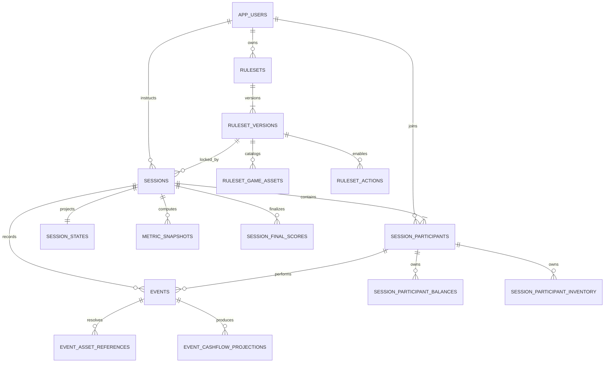

# Dokumentasi Database Cashflowpoly

Dokumen ini menjelaskan schema, relasi, tabel, view, constraint, trigger, seed, backup, restore, reset, dan prosedur perubahan database Cashflowpoly Analytics Platform.

Baseline aktif: **schema `3.0.13`**.

Navigasi:

- [README utama](README.md)
- [Dokumentasi REST API](README-API.md)
- [Desain database terperinci](docs/02-Perancangan/02-01-rancangan-database-dan-model-data.md)

## Daftar isi

- [Model relasi utama](#model-relasi-utama)
- [Konvensi penyimpanan](#konvensi-penyimpanan)
- [Katalog tabel](#katalog-tabel)
- [View database](#view-database)
- [Constraint dan invariant penting](#constraint-dan-invariant-penting)
- [Function dan trigger](#function-dan-trigger)
- [Query inspeksi database](#query-inspeksi-database)
- [Urutan inisialisasi](#urutan-inisialisasi)
- [Menjalankan Seed 2 ulang](#menjalankan-seed-2-ulang)
- [Backup dan restore](#backup-developmentproduction)
- [Reset penuh development](#reset-penuh-development)
- [Perubahan schema](#perubahan-schema)

Schema PostgreSQL canonical berada pada [`database/00_create_schema.sql`](database/00_create_schema.sql). File tersebut—bukan diagram, model EF Core, atau dokumentasi ini—adalah sumber teknis terakhir untuk tabel, kolom, foreign key, constraint, index, view, function, dan trigger. API memakai Dapper/Npgsql untuk akses utama, memiliki pemetaan EF Core untuk sebagian model, dan menerapkan **bootstrap schema SQL kanonik** saat startup. Baseline aktif adalah schema `3.0.13`.

Dokumentasi desain yang lebih terperinci tersedia pada [`docs/02-Perancangan/02-01-rancangan-database-dan-model-data.md`](docs/02-Perancangan/02-01-rancangan-database-dan-model-data.md).

## Model relasi utama



Relasi di atas disederhanakan untuk orientasi. Foreign key lengkap, termasuk relasi komposit berbasis `session_id`, `event_id`, `ruleset_version_id`, dan `session_participant_id`, tetap mengikuti SQL canonical.

## Konvensi penyimpanan

| Konvensi | Penerapan |
|---|---|
| Primary key | Umumnya UUID hasil `gen_random_uuid()`; `events` juga memiliki `event_pk` internal |
| Username | `citext`, sehingga unik tanpa membedakan huruf besar/kecil |
| Waktu | `timestamptz`; kirim dan tampilkan sebagai ISO-8601, idealnya UTC |
| Payload dinamis | `jsonb`, hanya untuk data yang memang bervariasi; relasi penting tetap dinormalisasi |
| Nama database | `snake_case`; nama JSON mengikuti `[JsonPropertyName]` pada DTO |
| Nilai uang/poin gameplay | Mayoritas integer di projection/ruleset; response analytics dapat memakai number/double |
| Soft state | `is_archived`, `archived_at`, atau kolom status sesuai resource |
| Provenance | Projection membawa `last_event_id`, `source_event_id`, atau `event_pk/event_id` bila relevan |

Extension yang diperlukan:

- `citext` untuk username case-insensitive;
- `pgcrypto` untuk `gen_random_uuid()` dan fungsi kriptografis seed.

## Katalog tabel

### Baseline, identitas, dan katalog aksi

| Tabel | Fungsi utama |
|---|---|
| `schema_baseline_versions` | Fingerprint nama, versi, checksum, dan waktu penerapan baseline schema |
| `app_users` | Akun, password hash, nama tampil, role `INSTRUCTOR`/`PLAYER`, dan status aktif |
| `actions` | Katalog aksi canonical, behavior, mode, arah cashflow, dan dampak domain |

### Ruleset dan seluruh komponen versinya

| Tabel | Fungsi utama |
|---|---|
| `rulesets` | Wadah ruleset, pemilik Instruktur, deskripsi, dan status arsip |
| `ruleset_versions` | Versi immutable, status `DRAFT/ACTIVE/ARCHIVED`, mode, hash konfigurasi, dan metadata publish |
| `ruleset_game_settings` | Modal/saldo awal, aksi per giliran, hari selesai, batas 2–4 pemain, inventory, serta feature flags |
| `ruleset_player_ordering_rules` | Aturan urutan pemain dan fitur per hari |
| `ruleset_actions` | Aksi yang diaktifkan pada satu versi ruleset |
| `ruleset_game_assets` | Registry bersama untuk asset/kartu yang dapat direferensikan |
| `ruleset_ingredients` | Bahan, harga beli, jumlah kartu, dan metadata |
| `ruleset_orders` | Pesanan, harga jual, poin, jumlah kartu, dan metadata |
| `ruleset_order_requirements` | Bahan dan kuantitas yang dibutuhkan sebuah pesanan |
| `ruleset_needs` | Kebutuhan, tier/family, harga, poin, dan jumlah kartu |
| `ruleset_need_set_bonuses` | Pola jumlah kebutuhan dan bonus poinnya |
| `ruleset_collection_missions` | Misi koleksi, poin sukses/gagal, penalti, dan jumlah kartu |
| `ruleset_collection_mission_requirements` | Syarat asset, tier, atau family untuk misi koleksi |
| `ruleset_financial_goals` | Tujuan finansial, target harga, poin, dan jumlah kartu |
| `ruleset_narratives` | Definisi narasi, repeatability, cooldown, dan metadata |
| `ruleset_narrative_scenes` | Urutan scene, teks, media, dan payload narasi |
| `ruleset_trigger_conditions` | Kondisi terstruktur yang mengaktifkan narasi/aksi |
| `ruleset_gold_prices` | Katalog jumlah dan harga emas |
| `ruleset_gold_assets` | Katalog kuantitas emas dan poinnya |
| `ruleset_rank_points` | Poin berdasarkan jenis ranking dan posisi |
| `ruleset_tie_breakers` | Kartu/nomor pemecah seri |
| `ruleset_sharia_loans` | Pokok, pelunasan, durasi, penalti, dan stok pinjaman |
| `ruleset_insurance_products` | Premi, batas penggunaan, status, dan stok produk asuransi |
| `ruleset_life_risks` | Risiko kehidupan, arah/nominal dampak, durasi, serta target |

Semua detail ruleset diikat ke `ruleset_version_id`. Versi yang sudah digunakan sesi tidak boleh ditimpa; perubahan menghasilkan versi baru.

### Sesi dan projection gameplay

| Tabel | Fungsi utama |
|---|---|
| `sessions` | Metadata sesi, owner, mode, status, jumlah pemain, waktu start/end, dan versi ruleset terkunci |
| `session_participants` | Hubungan akun Player ke sesi serta `player_order_no` |
| `session_states` | Hari, weekday, giliran, slot aksi, fase, versi state, dan event terakhir |
| `session_participant_balances` | Koin, happiness, saving, dan total donasi per peserta |
| `session_participant_inventory` | Kuantitas bahan/asset inventory per peserta |
| `session_participant_need_purchases` | Riwayat kebutuhan yang dibeli/dijual dan dampak poinnya |
| `session_participant_financial_goals` | Progres dan status tujuan finansial |
| `session_participant_collection_missions` | Penugasan serta status misi koleksi |
| `session_participant_action_counters` | Jumlah pemakaian tiap aksi |
| `session_participant_gold_holdings` | Kepemilikan emas yang tervalidasi terhadap katalog |
| `session_participant_loans` | Instance pinjaman, outstanding, pembayaran, status, dan provenance |
| `session_participant_insurances` | Polis, premi, sisa penggunaan, status, dan provenance |
| `session_participant_tie_breakers` | Nilai tie breaker peserta |
| `session_donation_events` | Kejadian/ranking donasi per hari |
| `session_card_positions` | Posisi instance kartu pada `DECK`, `MARKET`, `PLAYER`, atau `DISCARD` |
| `session_rule_effects` | Efek aturan/risiko sementara, scope, nilai delta, rentang hari, dan status aktif |

Projection di atas tidak boleh dijadikan jalur tulis dari klien. Semuanya dibentuk dari event valid atau proses recompute.

### Event, analitika, hasil akhir, dan operasional

| Tabel | Fungsi utama |
|---|---|
| `events` | Log gameplay terurut dan sumber kebenaran untuk replay |
| `event_asset_references` | Asset ruleset yang berhasil di-resolve dari path payload event |
| `event_cashflow_projections` | Baris transaksi `IN/OUT` yang dihasilkan event |
| `session_projection_checkpoints` | Sequence/event terakhir dan status rebuild projection |
| `metric_snapshots` | Nilai metric numeric/text/boolean/JSON per sesi atau pemain |
| `validation_logs` | Request event yang ditolak beserta error dan payload audit |
| `session_final_scores` | Total poin, ranking, tie breaker, dan status pinjaman saat finalisasi |
| `session_final_score_components` | Rincian setiap komponen pembentuk skor akhir |
| `session_narrative_logs` | Narasi/scene yang sudah ditampilkan dan event pemicunya |
| `security_audit_logs` | Login, challenge, forbidden, rate limit, identitas, path, outcome, dan trace |
| `log_retention_policies` | Hari retensi per kategori tabel log |

## View database

| View | Fungsi |
|---|---|
| `ruleset_catalog_items` | Menyatukan asset ruleset ke bentuk katalog yang konsisten |
| `ruleset_catalog_item_requirements` | Menyatukan requirement item/order untuk query katalog |
| `ruleset_collection_mission_requirement_items` | Menyajikan requirement misi beserta item referensinya |

View dibuat ulang oleh schema canonical agar definisinya tetap sinkron dengan tabel sumber.

## Constraint dan invariant penting

1. `app_users.username` unik secara case-insensitive.
2. Satu ruleset hanya dapat memiliki satu versi `ACTIVE`.
3. `ruleset_versions` unik pada `(ruleset_id, version)` dan `(ruleset_id, config_hash)`.
4. Mode sesi harus sama dengan mode versi ruleset yang dikunci.
5. Sesi hanya dapat berjalan dengan 2–4 peserta sesuai batas ruleset; satu akun dan satu nomor urut hanya boleh muncul sekali per sesi.
6. Event unik pada `(session_id, event_id)` dan `(session_id, sequence_number)`; `client_request_id` juga unik per sesi ketika diisi.
7. Event Player wajib merujuk akun/participant sesi yang sah; event system tidak menyamar sebagai Player.
8. `action_slot` dibatasi oleh `actions_per_turn`; aksi bebas/system memakai aturan slot khusus.
9. Asset reference, inventory, kartu, emas, pinjaman, asuransi, dan requirement harus berasal dari katalog versi ruleset yang sama.
10. Projection cashflow harus merujuk event sumber dan menjaga konsistensi session/user/direction/amount.
11. Saldo berjalan tidak boleh melewati batas minimum yang ditetapkan ruleset.
12. Ruleset default, versi aktif, versi terakhir, dan data yang sudah direferensikan sesi memiliki guard penghapusan.
13. Penutupan hari divalidasi dari event sebelumnya: dua aksi per pemain pada Senin–Kamis, satu donasi pada Jumat, serta satu keputusan emas setelah harga dibuka pada Sabtu.
14. Total holding emas satu sesi tidak boleh melebihi 20 kartu fisik; tujuan finansial tidak boleh melampaui `card_qty` katalog.

Sebagian invariant diperiksa dua lapis: validator domain di API memberikan error yang mudah dipahami, sedangkan foreign key/check/unique constraint dan trigger PostgreSQL menjaga data dari jalur tulis lain.

## Function dan trigger

Schema memasang function/trigger untuk:

- memperbarui `updated_at`;
- menyinkronkan `sessions.player_count` dari peserta;
- memvalidasi role peserta, batas pemain, mode, dan ruleset sesi;
- memvalidasi slot aksi dan scope event;
- memproyeksikan side effect event;
- memeriksa limit inventory serta katalog kartu/asset;
- menjaga konsistensi cashflow dan saldo berjalan;
- menjaga tipe asset requirement order/misi;
- menjaga provenance pada narrative dan projection.

Trigger adalah lapisan integritas terakhir, bukan API alternatif. Integrasi tetap harus menulis melalui REST API agar authorization, rate limit, audit, error contract, dan transaksi domain dijalankan.

## Query inspeksi database

Masuk ke `psql` container development:

```powershell
docker exec -it cashflowpoly-dev-db sh -lc 'psql -U "$POSTGRES_USER" -d "$POSTGRES_DB"'
```

Query aman untuk inspeksi:

```sql
-- Baseline schema aktif
select baseline_name, schema_version, checksum, applied_at
from schema_baseline_versions
order by applied_at desc;

-- Sesi dan ruleset yang dikunci
select s.session_id, s.session_name, s.mode, s.status,
       rv.ruleset_id, s.ruleset_version_id, rv.version
from sessions s
join ruleset_versions rv on rv.ruleset_version_id = s.ruleset_version_id
order by s.created_at desc;

-- Event terurut satu sesi
select sequence_number, event_id, actor_type, action_type,
       day_index, turn_number, action_slot, received_at
from events
where session_id = '<SESSION_UUID>'::uuid
order by sequence_number;

-- Snapshot metric terbaru satu pemain
select distinct on (metric_name)
       metric_name, metric_value_numeric, metric_value_text,
       metric_value_boolean, metric_payload_json, computed_at
from metric_snapshots
where session_id = '<SESSION_UUID>'::uuid
  and user_id = '<USER_UUID>'::uuid
order by metric_name, computed_at desc;
```

Gunakan query `SELECT` untuk diagnosis. Jangan memperbaiki projection dengan `UPDATE/DELETE` langsung; koreksi event/prosedur domain lalu gunakan recompute bila memang sesuai.

## Urutan inisialisasi

1. PostgreSQL start dan health check lulus.
2. API menjalankan [`database/00_create_schema.sql`](database/00_create_schema.sql).
3. API memverifikasi baseline `canonical_relational_baseline` versi `3.0.13`.
4. API memastikan komponen/ruleset default dari [`database/01_seed_default_rulesets_components.sql`](database/01_seed_default_rulesets_components.sql).
5. Seed 2 hanya berjalan bila dijalankan manual.

Schema canonical ditulis idempotent untuk startup normal. Jangan mengedit database production secara manual tanpa backup dan review SQL.

## Menjalankan Seed 2 ulang

```powershell
Get-Content -Raw database/02_seed_simulation_sessions_events.sql |
  docker exec -i cashflowpoly-dev-db sh -lc 'psql -v ON_ERROR_STOP=1 -U "$POSTGRES_USER" -d "$POSTGRES_DB"'
```

`ON_ERROR_STOP=1` penting agar proses berhenti pada statement pertama yang gagal.

## Backup development/production

```powershell
$backupFile = "cashflowpoly-$((Get-Date).ToString('yyyyMMdd-HHmmss')).sql"
docker exec cashflowpoly-dev-db sh -lc 'pg_dump --clean --if-exists -U "$POSTGRES_USER" -d "$POSTGRES_DB"' > $backupFile
```

Untuk production, ganti nama container dengan container database dari Compose production dan simpan hasil di lokasi backup terenkripsi. Verifikasi file backup tidak nol byte.

## Restore ke database kosong

```powershell
Get-Content -Raw .\cashflowpoly-YYYYMMDD-HHMMSS.sql |
  docker exec -i cashflowpoly-dev-db sh -lc 'psql -v ON_ERROR_STOP=1 -U "$POSTGRES_USER" -d "$POSTGRES_DB"'
```

Restore menimpa objek database target. Hentikan penulisan event dan buat backup sebelum menjalankannya.

## Reset penuh development

```powershell
docker compose --env-file config/env/.env.dev -f infra/docker/docker-compose.yml -f infra/docker/docker-compose.watch.yml down -v
docker compose --env-file config/env/.env.dev -f infra/docker/docker-compose.yml -f infra/docker/docker-compose.watch.yml up -d --build
```

> [!CAUTION]
> `down -v` menghapus volume Compose development termasuk seluruh data PostgreSQL yang belum dibackup. Perintah ini tidak boleh dipakai pada production.

Setelah reset, tunggu readiness API lalu jalankan Seed 2 kembali bila membutuhkan data simulasi.

## Perubahan schema

Saat mengubah model database:

1. ubah [`database/00_create_schema.sql`](database/00_create_schema.sql) secara idempoten;
2. naikkan fingerprint baseline bila perubahan kontrak memang memerlukannya;
3. sinkronkan model/repository/DTO yang terdampak;
4. sinkronkan Seed 1, Seed 2, Postman, dan dokumen desain;
5. uji startup pada database kosong dan database baseline yang masih didukung;
6. jalankan integration test PostgreSQL;
7. siapkan backup serta runbook migrasi/reset sebelum production.

Jika schema mendeteksi struktur lama yang sudah tidak didukung, startup sengaja gagal dengan instruksi reset. Jangan mengakali pemeriksaan fingerprint pada database yang menyimpan data penting.
