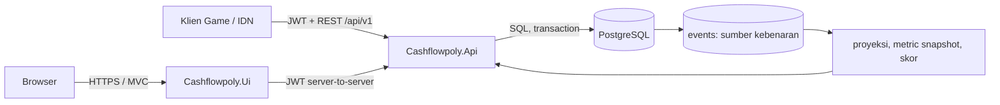

# Cashflowpoly Analytics Platform

Platform analitika untuk permainan papan Cashflowpoly. Sistem menerima aktivitas permainan sebagai rangkaian *event*, memvalidasinya terhadap aturan dan urutan permainan, menyimpannya di PostgreSQL, lalu membentuk proyeksi, skor, dan metrik yang dapat dibaca melalui REST API serta Web Analitik.

README ini adalah pintu masuk utama untuk menjalankan, memakai, mengintegrasikan, menguji, dan men-deploy proyek. Baseline implementasi yang didokumentasikan: **20 Agustus 2026**, skema database **`3.0.13`**, dan prefix API **`/api/v1`**.

> [!IMPORTANT]
> Web Analitik bukan klien operasional permainan. Pembuatan sesi, penambahan peserta, start/end sesi, dan pengiriman keputusan pemain dilakukan oleh Klien Game/IDN atau integrasi REST API. Web Analitik membaca hasil dan menyediakan pengelolaan *ruleset* untuk Instruktur.

## Daftar isi

- [Gambaran sistem](#gambaran-sistem)
- [Arsitektur dan alur data](#arsitektur-dan-alur-data)
- [Peran dan hak akses](#peran-dan-hak-akses)
- [Struktur repositori](#struktur-repositori)
- [Menjalankan proyek dengan Docker](#menjalankan-proyek-dengan-docker)
- [Akun awal dan data demo Seed 2](#akun-awal-dan-data-demo-seed-2)
- [Alur penggunaan lengkap](#alur-penggunaan-lengkap)
- [Pengembangan tanpa Docker](#pengembangan-tanpa-docker)
- [Konfigurasi](#konfigurasi)
- [Dokumentasi teknis terpisah](#dokumentasi-teknis-terpisah)
  - [Dokumentasi REST API](README-API.md)
  - [Dokumentasi database](README-DATABASE.md)
- [Pengujian dan pemeriksaan kualitas](#pengujian-dan-pemeriksaan-kualitas)
- [Deployment produksi](#deployment-produksi)
- [Observabilitas dan troubleshooting](#observabilitas-dan-troubleshooting)
- [Keamanan](#keamanan)
- [Dokumentasi lanjutan](#dokumentasi-lanjutan)

## Gambaran sistem

Cashflowpoly Analytics Platform memiliki empat tanggung jawab utama:

1. Menerima data permainan dari Klien Game/IDN melalui REST API.
2. Menolak data yang tidak sah, tidak berurutan, duplikat, atau melanggar aturan domain.
3. Menyimpan setup fisik yang dikonfirmasi dan event gameplay sebagai sumber kebenaran, lalu membentuk proyeksi yang dapat dihitung ulang.
4. Menyajikan hasil sesi dan pemain pada Web Analitik sesuai peran pengguna.

Fitur utamanya meliputi:

- autentikasi JWT untuk API dan autentikasi cookie terenkripsi untuk UI;
- akun `INSTRUCTOR` dan `PLAYER` dengan data yang dibatasi berdasarkan kepemilikan/partisipasi;
- *ruleset* berversi dan immutable setelah dipakai sesi;
- mode permainan `PEMULA` dan `MAHIR`;
- lifecycle sesi `CREATED` → `STARTED` → `ENDED`;
- ingestion event tunggal dan batch;
- validasi `sequence_number`, `action_slot`, aktor, hari, giliran, payload, dan versi ruleset;
- proyeksi arus kas, kepemilikan yang dilaporkan, kebutuhan, misi, risiko, pinjaman, asuransi, dan skor;
- ringkasan sesi, transaksi, metrik gameplay pemain, leaderboard, dan ringkasan ruleset;
- audit keamanan, health checks, Prometheus metrics, tracing, dan rate limiting;
- Swagger/OpenAPI pada environment Development;
- Docker Compose untuk development dan production.

Teknologi inti:

| Komponen | Teknologi |
|---|---|
| API | ASP.NET Core 10, Dapper, Npgsql, JWT Bearer, OpenTelemetry |
| Web Analitik | ASP.NET Core MVC/Razor, CSS/Tailwind build pipeline, `HttpClient` ke API |
| Database | PostgreSQL 16; PostgreSQL 15+ masih didukung |
| Dokumentasi API | OpenAPI/Swagger dan Postman |
| Pengujian | xUnit v3 dan Testcontainers PostgreSQL |
| Deployment | Docker Compose, Nginx, dan Cloudflare Tunnel opsional |

## Arsitektur dan alur data



Alur data satu keputusan pemain:

1. Pengguna login melalui Klien Game/IDN atau Web Analitik.
2. Klien mengirim event ke `POST /api/v1/events` menggunakan JWT.
3. API memeriksa identitas, akses sesi, status sesi, versi ruleset, urutan, slot aksi, dan payload.
4. Event valid disimpan dan proyeksi terkait diperbarui dalam transaksi database. Backend tidak mengacak atau menebak isi pasar/deck fisik.
5. Event tidak valid ditolak; event tersebut tidak menjadi aktivitas permainan yang berhasil.
6. Web Analitik meminta data melalui endpoint analytics—UI tidak membaca database secara langsung.
7. Jika diperlukan, Instruktur dapat membangun ulang hasil melalui endpoint recompute.

### Sumber kebenaran dan proyeksi

- Revisi terakhir pada `session_setup_revisions` adalah sumber pembagian awal; setelah start, revisi tersebut dikunci.
- Tabel `events` adalah sumber kebenaran untuk gameplay setelah setup.
- Tabel saldo, inventory, aset, risiko, pinjaman, asuransi, narrative, skor, dan metric snapshot adalah proyeksi yang memiliki provenance event.
- Perubahan state tidak boleh dikirim langsung. `PUT /api/v1/sessions/{sessionId}/state` tetap ada sebagai guard kompatibilitas dan selalu mengembalikan `410 STATE_WRITE_DISABLED` setelah akses diverifikasi.
- `ruleset_version_id` dikunci pada sesi sehingga hasil lama tidak berubah ketika Instruktur menerbitkan versi ruleset baru.

### Identitas yang sering tertukar

| Istilah | Arti |
|---|---|
| `user_id` | ID akun aplikasi pada `app_users` |
| `instructor_user_id` | Pemilik sesi/ruleset |
| `session_participant_id` | ID baris partisipasi pemain di database |
| `session_player_id` | Nama kompatibilitas untuk peserta sesi pada kontrak tertentu |
| `player_order_no` | Urutan pemain/giliran dalam sesi |
| `event_id` | ID global event untuk deteksi duplikasi |
| `sequence_number` | Nomor urut event yang harus kontigu dalam satu sesi |

## Peran dan hak akses

| Kemampuan | Publik | `PLAYER` | `INSTRUCTOR` |
|---|:---:|:---:|:---:|
| Login | ✓ | ✓ | ✓ |
| Registrasi akun Player | ✓ | — | — |
| Membaca rulebook publik | ✓ | ✓ | ✓ |
| Melihat sesi | — | Hanya yang diikuti | Hanya yang dimiliki |
| Melihat analitika pemain | — | Hanya diri sendiri | Peserta sesi miliknya |
| Membuat akun Player | — | — | ✓ |
| Membuat/start/end sesi | — | — | ✓ |
| Menambah Player ke sesi | — | — | ✓ |
| Mengirim event | — | Sesuai sesi dan aktor | Sesuai sesi miliknya |
| Membuat/mengubah/mengaktifkan ruleset | — | — | ✓ |
| Membaca ruleset | — | Sesuai cakupan + default | Sesuai cakupan + default |
| Recompute analitika | — | — | ✓ |
| Audit log/operational summary | — | — | ✓ |

Aturan penting:

- Registrasi publik hanya menerima role `PLAYER`.
- Akun Instruktur pertama dibuat melalui bootstrap terkontrol atau seed lokal, bukan melalui halaman registrasi publik.
- Instruktur tidak otomatis dapat melihat sesi/ruleset milik Instruktur lain.
- Player tidak dapat meminta analitika Player lain dengan mengganti ID pada URL.
- Ruleset default dapat dibaca, tetapi tidak dapat dimutasi/dihapus.

## Struktur repositori

```text
cashflowpoly-analytics-platform/
├── config/env/                 # template environment development/production
├── database/                   # schema canonical dan seed SQL
├── docs/                       # panduan, spesifikasi, desain, dan laporan uji
├── infra/
│   ├── docker/                 # compose base, development watch, production
│   └── nginx/                  # reverse proxy production
├── postman/                    # collection dan environment lokal
├── scripts/                    # pemeriksaan readiness production
├── src/
│   ├── Cashflowpoly.Api/       # REST API, domain, persistence, analytics
│   └── Cashflowpoly.Ui/        # MVC/Razor Web Analitik
├── tests/
│   ├── Cashflowpoly.Api.Tests/
│   └── Cashflowpoly.Ui.Tests/
├── Cashflowpoly.sln
├── README-API.md
├── README-DATABASE.md
└── README.md
```

File yang menjadi acuan implementasi:

- schema canonical: [`database/00_create_schema.sql`](database/00_create_schema.sql);
- komponen/ruleset default: [`database/01_seed_default_rulesets_components.sql`](database/01_seed_default_rulesets_components.sql);
- simulasi lokal: [`database/02_seed_simulation_sessions_events.sql`](database/02_seed_simulation_sessions_events.sql);
- kontrak payload event: [`docs/02-Perancangan/02-02-rancangan-kontrak-api-dan-event.md`](docs/02-Perancangan/02-02-rancangan-kontrak-api-dan-event.md);
- model data: [`docs/02-Perancangan/02-01-rancangan-database-dan-model-data.md`](docs/02-Perancangan/02-01-rancangan-database-dan-model-data.md);
- definisi metrik: [`docs/02-Perancangan/02-03-rancangan-definisi-dan-agregasi-metrik.md`](docs/02-Perancangan/02-03-rancangan-definisi-dan-agregasi-metrik.md).

## Menjalankan proyek dengan Docker

Ini adalah cara yang direkomendasikan karena versi PostgreSQL dan jaringan antarservice sudah konsisten.

### Prasyarat

- Git;
- Docker Desktop dengan Docker Compose v2;
- PowerShell 7 direkomendasikan pada Windows;
- port `5432`, `5041`, dan `5203` tersedia, atau ubah nilainya pada env;
- minimal sekitar 4 GB RAM kosong untuk build dan runtime development.

### 1. Clone dan masuk ke repositori

```powershell
git clone <URL_REPOSITORI>
Set-Location cashflowpoly-analytics-platform
```

### 2. Buat konfigurasi development

```powershell
Copy-Item config/env/.env.dev.example config/env/.env.dev
```

Edit `config/env/.env.dev`, minimal:

```dotenv
POSTGRES_PASSWORD=ganti-dengan-password-lokal-yang-kuat
JWT_SIGNING_KEY=ganti-dengan-random-secret-minimal-32-karakter
```

Jangan commit file `.env.dev` atau nilai rahasia.

### 3. Validasi konfigurasi Compose

```powershell
docker compose `
  --env-file config/env/.env.dev `
  -f infra/docker/docker-compose.yml `
  -f infra/docker/docker-compose.watch.yml `
  config -q
```

Tidak ada output berarti konfigurasi valid.

### 4. Build dan jalankan development stack

```powershell
docker compose `
  --env-file config/env/.env.dev `
  -f infra/docker/docker-compose.yml `
  -f infra/docker/docker-compose.watch.yml `
  up -d --build
```

Service development menggunakan `dotnet watch`; perubahan source API/UI dimuat ulang tanpa rebuild image manual pada sebagian besar kasus. Pipeline CSS UI juga berjalan dalam mode watch.

### 5. Periksa status

```powershell
docker compose `
  --env-file config/env/.env.dev `
  -f infra/docker/docker-compose.yml `
  -f infra/docker/docker-compose.watch.yml `
  ps
```

Endpoint lokal:

| Layanan | URL |
|---|---|
| Web Analitik | <http://localhost:5203> |
| API landing page | <http://localhost:5041> |
| Swagger UI | <http://localhost:5041/swagger> |
| OpenAPI JSON | <http://localhost:5041/swagger/v1/swagger.json> |
| API liveness | <http://localhost:5041/health/live> |
| API readiness | <http://localhost:5041/health/ready> |
| UI liveness | <http://localhost:5203/health/live> |
| UI readiness | <http://localhost:5203/health/ready> |

Nama container development default:

- `cashflowpoly-dev-db`;
- `cashflowpoly-dev-api`;
- `cashflowpoly-dev-ui`.

### 6. Lihat log

```powershell
docker compose `
  --env-file config/env/.env.dev `
  -f infra/docker/docker-compose.yml `
  -f infra/docker/docker-compose.watch.yml `
  logs -f api ui
```

Tekan `Ctrl+C` untuk keluar dari tampilan log; container tetap berjalan.

### 7. Hentikan atau bangun ulang

```powershell
# Hentikan tetapi pertahankan database/volume
docker compose --env-file config/env/.env.dev -f infra/docker/docker-compose.yml -f infra/docker/docker-compose.watch.yml down

# Build ulang setelah perubahan dependency/Dockerfile
docker compose --env-file config/env/.env.dev -f infra/docker/docker-compose.yml -f infra/docker/docker-compose.watch.yml up -d --build
```

## Akun awal dan data demo Seed 2

Pilih salah satu pendekatan berikut.

### Opsi A — Seed 2 untuk demo development

Seed 2 menyediakan dua sesi deterministik (`PEMULA` dan `MAHIR`) beserta event dan akun demo. Jalankan setelah database/API pertama kali berhasil start:

```powershell
Get-Content -Raw database/02_seed_simulation_sessions_events.sql |
  docker exec -i cashflowpoly-dev-db sh -lc 'psql -v ON_ERROR_STOP=1 -U "$POSTGRES_USER" -d "$POSTGRES_DB"'
```

Akun demo lokal:

| Peran | Username | Password |
|---|---|---|
| Instruktur | `rina.kartika` | `SeedLocal!2026` |
| Player | `marco` | `SeedLocal!2026` |
| Player | `marcello` | `SeedLocal!2026` |
| Player | `hugo` | `SeedLocal!2026` |
| Player | `manalu` | `SeedLocal!2026` |

Seed ini hanya untuk development/demo. Jangan memakai password tersebut di production. Seed 2 mengganti data pada scope demo deterministiknya, bukan menjadi mekanisme migrasi production.

### Opsi B — Bootstrap Instruktur pertama

Isi sementara pada `config/env/.env.dev`:

```dotenv
AUTH_BOOTSTRAP_SEED_DEFAULT_USERS=true
AUTH_BOOTSTRAP_INSTRUCTOR_USERNAME=instruktur.awal
AUTH_BOOTSTRAP_INSTRUCTOR_PASSWORD=password-kuat-minimal-12-karakter
```

Recreate API:

```powershell
docker compose --env-file config/env/.env.dev -f infra/docker/docker-compose.yml -f infra/docker/docker-compose.watch.yml up -d --force-recreate api
```

Setelah login berhasil:

1. ubah `AUTH_BOOTSTRAP_SEED_DEFAULT_USERS=false`;
2. kosongkan kedua nilai username/password bootstrap;
3. recreate API sekali lagi.

Player selanjutnya dapat mendaftar sendiri atau dibuat oleh Instruktur melalui API.

## Alur penggunaan lengkap

### A. Alur Instruktur dari nol

1. Login sebagai Instruktur.
2. Buka **Set Aturan** pada Web Analitik.
3. Gunakan ruleset default atau buat ruleset baru dari komponen default.
4. Periksa mode, batas pemain, modal awal, aksi per giliran, komponen, dan semua parameter.
5. Aktifkan versi ruleset yang akan dipakai.
6. Dari Klien Game/IDN, buat sesi dengan `ruleset_version_id` aktif tersebut.
7. Buat akun Player bila belum ada atau cari akun yang sudah terdaftar.
8. Tambahkan Player ke sesi. Nomor urut sementara akan diganti sesuai hasil Tie Breaker saat start.
9. Lakukan pembagian kartu fisik sesuai buku aturan, lalu IDN mengirim Tie Breaker, kartu bahan, emas, misi, serta tambahan mode Mahir untuk setiap `session_player_id`.
10. Validasi lalu simpan pembagian awal melalui endpoint setup. Sebelum start, kirim revisi baru dengan `client_request_id` baru bila ada kesalahan. Sejak revisi pertama, daftar peserta dan ruleset tidak dapat diganti.
11. Start sesi. API mengunci revisi terbaru dan membentuk event setup secara atomik; backend tidak membagikan kartu pemain secara acak.
12. Kirim keputusan sebagai event berurutan selama permainan.
13. Gunakan halaman detail/timeline/analitika pemain untuk memantau hasil.
14. End sesi. API menyelesaikan proyeksi dan skor final.
15. Buka **Ringkasan Statistik Pemain**, **Cerita di Balik Hasil Pemain**, dan **Data Permainan Lengkap** untuk audit hasil.

### B. Alur Player

1. Daftar melalui `/auth/register` atau gunakan akun yang dibuat Instruktur.
2. Login ke Web Analitik.
3. Buka **Sesi Permainan** untuk melihat sesi yang diikuti.
4. Buka detail sesi dan analitika diri sendiri.
5. Pelajari angka pembentuk, rumus dengan nilai aktual, sumber data, timeline, serta data permainan lengkap.
6. Player tidak dapat melihat analitika peserta lain, mengubah ruleset, atau mengelola lifecycle sesi.

### C. Alur integrasi Klien Game/IDN

Urutan minimum integrasi:

```text
login Instruktur
  → pilih/buat + aktifkan ruleset
  → buat sesi
  → buat/cari Player
  → tambahkan Player ke sesi
  → baca session_player_id
  → validasi + simpan/revisi pembagian awal fisik
  → start sesi
  → baca next_sequence_number setelah start
  → kirim event dengan sequence kontigu sampai N
  → end sesi
  → baca/recompute analitika
```

Klien harus menyimpan setidaknya:

- JWT dan waktu kedaluwarsanya;
- `ruleset_id` dan `ruleset_version_id`;
- `session_id`;
- `user_id` serta `player_order_no` setiap peserta;
- `event_id` unik;
- `sequence_number` terakhir yang berhasil disimpan;
- `client_request_id` bila membutuhkan korelasi log klien-server.
- `cursor` terakhir ketika memuat event atau transaksi per halaman.

### D. Peta halaman Web Analitik

| Route | Fungsi | Akses |
|---|---|---|
| `/` | Dashboard operasional ringkas | Login |
| `/auth/login` | Login | Publik |
| `/auth/register` | Registrasi Player | Publik |
| `/rulebook` | Buku aturan permainan | Publik |
| `/sessions` | Daftar sesi sesuai scope | Login |
| `/sessions/{sessionId}` | Detail sesi | Sesuai scope |
| `/sessions/{sessionId}/timeline` | Urutan event sesi | Sesuai scope |
| `/sessions/{sessionId}/players/{playerId}` | Analitika pemain (`playerId` adalah `user_id`) | Instruktur pemilik / Player sendiri |
| `/players` | Direktori Player yang dapat diakses | Login |
| `/rulesets` | Daftar ruleset | Login |
| `/rulesets/create` | Membuat ruleset | Instruktur |
| `/rulesets/{rulesetId}` | Detail ruleset/version | Sesuai scope |
| `/rulesets/{rulesetId}/edit` | Membuat versi ruleset baru | Instruktur |

## Pengembangan tanpa Docker

### Prasyarat

- .NET SDK 10;
- Node.js/npm untuk build CSS UI;
- PostgreSQL 15+;
- connection string database yang dapat diakses API.

### Restore dan build

```powershell
dotnet restore Cashflowpoly.sln
dotnet build Cashflowpoly.sln -c Debug --no-restore /warnaserror
```

### Database lokal

API menjalankan schema canonical dan memastikan seed ruleset default saat startup. Database dan user PostgreSQL tetap harus tersedia terlebih dahulu. Atur connection string melalui environment:

```powershell
$env:ConnectionStrings__Default = 'Host=localhost;Port=5432;Database=cashflowpoly;Username=cashflowpoly;Password=<PASSWORD>'
$env:JWT_SIGNING_KEY = '<RANDOM_SECRET_MINIMAL_32_KARAKTER>'
```

### Jalankan API

```powershell
dotnet watch --project src/Cashflowpoly.Api/Cashflowpoly.Api.csproj
```

### Jalankan UI pada terminal lain

```powershell
$env:ApiBaseUrl = 'http://localhost:5041'
dotnet watch --project src/Cashflowpoly.Ui/Cashflowpoly.Ui.csproj
```

Jika CSS source berubah, jalankan pipeline package UI dari `src/Cashflowpoly.Ui` sesuai script di `package.json`:

```powershell
Set-Location src/Cashflowpoly.Ui
npm ci
npm run tailwind:build
```

Gunakan `launchSettings.json` masing-masing proyek untuk port development IDE. Port tersebut dapat berbeda dari port Docker (`5041` dan `5203`).

## Konfigurasi

Template tersedia pada:

- [`config/env/.env.dev.example`](config/env/.env.dev.example);
- [`config/env/.env.prod.example`](config/env/.env.prod.example).

### Environment utama

| Variabel | Wajib | Default/contoh | Fungsi |
|---|:---:|---|---|
| `POSTGRES_DB` | ✓ | `cashflowpoly` | Nama database |
| `POSTGRES_USER` | ✓ | `cashflowpoly` | User database |
| `POSTGRES_PASSWORD` | ✓ | — | Password database; production minimal 16 karakter |
| `POSTGRES_PORT` | — | `5432` | Port host development |
| `API_ASPNETCORE_ENVIRONMENT` | ✓ | `Development`/`Production` | Environment API |
| `API_HTTP_PORT` | — | `5041` | Port host API development |
| `UI_ASPNETCORE_ENVIRONMENT` | ✓ | `Development`/`Production` | Environment UI |
| `UI_HTTP_PORT` | — | `5203` | Port host UI development |
| `JWT_SIGNING_KEY` | ✓ | — | Signing key aktif minimal 32 karakter |
| `JWT_ACTIVE_KEY_ID` | — | `legacy` | ID key JWT aktif |
| `JWT_SIGNING_KEYS_JSON` | — | — | Key ring JSON untuk rotasi |
| `JWT_SIGNING_KEY_FILE` | — | — | Alternatif secret tunggal dari file |
| `JWT_SIGNING_KEYS_FILE` | — | — | Alternatif key ring dari file |
| `AUTH_BOOTSTRAP_SEED_DEFAULT_USERS` | — | `false` | Mengaktifkan bootstrap akun awal |
| `AUTH_BOOTSTRAP_INSTRUCTOR_USERNAME` | Kondisional | — | Username bootstrap Instruktur |
| `AUTH_BOOTSTRAP_INSTRUCTOR_PASSWORD` | Kondisional | — | Password bootstrap Instruktur |
| `AUTH_BOOTSTRAP_PLAYER_USERNAME` | Kondisional | — | Username bootstrap Player opsional |
| `AUTH_BOOTSTRAP_PLAYER_PASSWORD` | Kondisional | — | Password bootstrap Player opsional |
| `DATABASE_MIGRATIONS_SEED_SIMULATION` | — | `false` | Menjalankan Seed 2 idempoten setelah migrasi; aktifkan hanya pada proses migrasi yang disengaja |
| `LEGACY_API_COMPATIBILITY` | — | `false` | Variabel transisi yang masih ada di template; belum dibaca runtime saat ini |
| `DOMAIN` | Produksi | `narafin.org` | Host publik untuk Nginx |
| `CLOUDFLARE_TUNNEL_TOKEN` | Profil tunnel | — | Token tunnel HTTPS publik |

Konfigurasi aplikasi nonrahasia terdapat pada `appsettings.json`. Environment memakai notasi `__` untuk key bertingkat, misalnya `Jwt__AccessTokenMinutes=480`.

### JWT dan sesi UI

- issuer: `Cashflowpoly.Api`;
- audience: `Cashflowpoly.Client`;
- masa berlaku default: 480 menit (8 jam);
- toleransi clock skew: 30 detik;
- UI menukar username/password ke API, lalu menyimpan token di dalam authentication cookie terenkripsi;
- cookie UI `HttpOnly`, `SameSite=Lax`, kedaluwarsa 8 jam, dan tidak menggunakan sliding expiration;
- form mutasi UI dilindungi antiforgery token.

Saat rotasi key, pertahankan key lama pada key ring sampai semua token lama kedaluwarsa, ganti `JWT_ACTIVE_KEY_ID`, lalu deploy ulang API/UI.

## Dokumentasi teknis terpisah

Dokumentasi teknis rinci ditempatkan pada README terpisah di root proyek:

- [README-API.md](README-API.md) — autentikasi, seluruh endpoint, kontrak request/response, event, ruleset, analitika, error, dan Postman.
- [README-DATABASE.md](README-DATABASE.md) — relasi, seluruh tabel dan view, migrasi berurutan, constraint, trigger, seed, query inspeksi, reset development, dan risiko operasi tanpa backup.

API aktif memakai prefix `/api/v1`. Database kosong memakai baseline SQL lalu migrasi berurutan yang dicatat bersama checksum pada `schema_history`; instance runtime biasa tidak menjalankan migrasi. Ringkasan setup tetap berada di README utama; detail kontrak dipelihara pada kedua dokumen di atas.

## Pengujian dan pemeriksaan kualitas

### Gerbang rilis lengkap

Jalankan satu perintah berikut sebelum commit rilis, merge ke `prod`, atau deployment:

```powershell
.\scripts\Invoke-ReleaseVerification.ps1
```

Gerbang ini menjalankan restore dan build ketat, seluruh unit/integration/contract test, audit kerentanan NuGet dan npm, pemeriksaan konsistensi dokumentasi, uji performa 100 akun/20 sesi/20 pengguna bersamaan, migrasi dan Seed 2 pada Docker development, E2E Chromium desktop dan ponsel, validasi Compose, serta build image Docker. Gunakan parameter `-SkipBrowser`, `-SkipPerformance`, atau `-SkipDockerBuild` hanya untuk iterasi lokal; pemeriksaan akhir tidak boleh memakai parameter skip.

E2E dapat dijalankan tersendiri setelah aplikasi development aktif:

```powershell
Push-Location tests/e2e
npm ci
npx playwright install chromium
npm test
Pop-Location
```

### Build ketat

```powershell
dotnet restore Cashflowpoly.sln
dotnet build Cashflowpoly.sln -c Release --no-restore /warnaserror
```

### Unit/source tests API

```powershell
dotnet test tests/Cashflowpoly.Api.Tests/Cashflowpoly.Api.Tests.csproj `
  -c Release `
  --filter "Category!=Integration"
```

### Integration tests API

Docker harus aktif karena Testcontainers membuat PostgreSQL sementara:

```powershell
dotnet test tests/Cashflowpoly.Api.Tests/Cashflowpoly.Api.Tests.csproj `
  -c Release `
  --filter "Category=Integration"
```

### UI tests

```powershell
dotnet test tests/Cashflowpoly.Ui.Tests/Cashflowpoly.Ui.Tests.csproj -c Release
```

### Semua test

```powershell
dotnet test Cashflowpoly.sln -c Release
```

### Validasi Compose

```powershell
docker compose --env-file config/env/.env.dev -f infra/docker/docker-compose.yml -f infra/docker/docker-compose.watch.yml config -q
docker compose --env-file config/env/.env.prod -f infra/docker/docker-compose.yml -f infra/docker/docker-compose.prod.yml --profile tunnel config -q
```

Perintah terpisah di atas berguna ketika mengembangkan satu modul. Sebelum merge/deploy, jalankan gerbang rilis lengkap tanpa parameter skip dan pastikan `git diff --check` bersih.

## Deployment produksi

Panduan runbook lengkap berada di [`docs/00-Panduan/00-04-panduan-deployment-produksi.md`](docs/00-Panduan/00-04-panduan-deployment-produksi.md). Ringkasan aman:

### 1. Siapkan env

```powershell
Copy-Item config/env/.env.prod.example config/env/.env.prod
```

Wajib diganti:

- `POSTGRES_PASSWORD`: unik, non-placeholder, minimal 16 karakter;
- `JWT_SIGNING_KEY`: random, non-placeholder, minimal 32 karakter;
- `DOMAIN`: domain production, bukan localhost;
- `CLOUDFLARE_TUNNEL_TOKEN`: bila profil tunnel digunakan;
- bootstrap Instruktur hanya bila database benar-benar baru.

### 2. Jalankan readiness check

```powershell
.\scripts\Test-ProductionReadiness.ps1
```

### 3. Validasi Compose

```powershell
docker compose `
  --env-file config/env/.env.prod `
  -f infra/docker/docker-compose.yml `
  -f infra/docker/docker-compose.prod.yml `
  --profile tunnel `
  config -q
```

### 4. Deploy dari VPS

```bash
sudo APP_ROOT=/opt/cashflowpoly \
  REPOSITORY_DIR=/opt/cashflowpoly/repository \
  ENV_FILE=/opt/cashflowpoly/shared/.env.prod \
  BRANCH=prod \
  /opt/cashflowpoly/repository/scripts/deploy-production.sh
```

Skrip mengambil commit terbaru `origin/prod`, mengunci proses agar tidak berjalan ganda, membangun API/UI secara berurutan, menampilkan maintenance singkat, menjalankan `--migrate-only`, Seed 2 idempoten, rekalkulasi analitik, health/smoke test, lalu mempertahankan rilis aktif dan satu rilis sebelumnya.

### 5. Verifikasi

```powershell
docker compose --env-file config/env/.env.prod -f infra/docker/docker-compose.yml -f infra/docker/docker-compose.prod.yml --profile tunnel ps
```

Periksa:

- `https://<DOMAIN>/health/live`;
- `https://<DOMAIN>/health/ready`;
- halaman login UI;
- login API/UI dengan akun yang sah;
- scope akses Player dan Instruktur;
- log API/UI/Nginx tidak berulang error;
- `/swagger` tidak tersedia pada Production;
- database dan API tidak dipublikasikan langsung ke internet.
- akses publik `/metrics` menghasilkan `404`.

### 6. Matikan bootstrap

Jika bootstrap digunakan, segera set flag ke `false`, kosongkan secret bootstrap, dan recreate API.

### Rollback

Jika health/smoke test gagal, skrip menjalankan kembali image dari SHA sebelumnya. Schema database tidak diturunkan, sehingga semua migrasi wajib kompatibel maju (*expand/contract*).

Keputusan proyek ini secara eksplisit tidak membuat backup database, termasuk sebelum migrasi. Kegagalan VPS, kesalahan operator, atau migrasi rusak dapat menyebabkan kehilangan data permanen. Jangan memakai `down -v`, `DROP DATABASE`, atau reset Seed pada production.

## Observabilitas dan troubleshooting

### Health checks

| Check | API | UI |
|---|---|---|
| `/health/live` | proses hidup | proses hidup |
| `/health/ready` | proses + PostgreSQL siap | proses + API siap |

Interpretasi cepat:

- API live gagal: proses crash/port salah;
- API live lulus tetapi ready gagal: periksa connection string, PostgreSQL, schema startup, atau credential DB;
- UI live lulus tetapi ready gagal: periksa `ApiBaseUrl`, jaringan Compose, dan readiness API.

### Log

```powershell
docker logs --tail 200 cashflowpoly-dev-api
docker logs --tail 200 cashflowpoly-dev-ui
docker logs --tail 200 cashflowpoly-dev-db
```

Ketika melaporkan error API, sertakan:

- waktu dan timezone;
- method/path tanpa credential;
- status HTTP;
- `error_code`;
- `X-Trace-Id`/`trace_id`;
- `X-Client-Request-Id` bila ada;
- `session_id`, `event_id`, dan `sequence_number` yang relevan;
- potongan log yang sudah disensor.

### Masalah umum

| Gejala | Pemeriksaan/perbaikan |
|---|---|
| Login `401` | Pastikan akun aktif, password benar, key JWT API konsisten, dan jam host tidak meleset |
| UI kembali ke login | Token/cookie kedaluwarsa; login ulang dan periksa `ApiBaseUrl` |
| API `403` | Role benar tetapi resource mungkin bukan milik/partisipasi pengguna |
| Event `409` | Periksa duplicate `event_id` atau sequence terakhir sesi |
| Event `422` | Baca `details`; payload/aksi melanggar ruleset atau status permainan |
| Start sesi gagal | Cek versi ruleset aktif, mode cocok, jumlah Player, dan pembagian awal IDN yang sudah dikunci |
| Analytics kosong | Pastikan event tersimpan; end/recompute sesi bila sesuai |
| API ready gagal | Cek `docker logs`, credential DB, health container DB, dan baseline schema |
| Perubahan CSS tidak tampil | Pastikan Tailwind watcher berjalan; hard refresh browser |
| Port bentrok | Ubah `POSTGRES_PORT`, `API_HTTP_PORT`, atau `UI_HTTP_PORT` pada env |
| Swagger hilang | Swagger memang hanya tersedia pada Development |

### Prometheus dan tracing

- scrape `/metrics` hanya dari jaringan internal container;
- Nginx sengaja mengembalikan `404` untuk `/metrics` dari akses publik;
- OpenTelemetry menambahkan trace/metric runtime dan request;
- gunakan trace ID untuk menghubungkan error response dengan log server.

## Keamanan

Checklist minimum:

- jangan commit `.env.dev`, `.env.prod`, token tunnel, password, JWT, dump DB, atau token hasil login;
- gunakan password akun minimal 12 karakter (maksimal 72 byte UTF-8) dan password DB production minimal 16 karakter;
- gunakan secret JWT random minimal 32 karakter dan rotasi dengan key ID;
- matikan bootstrap segera setelah akun pertama terbentuk;
- jangan izinkan registrasi publik Instruktur;
- expose hanya Nginx/HTTPS pada production—bukan PostgreSQL, API, atau `/metrics` langsung;
- pertahankan scope berbasis owner/participant; jangan mengandalkan penyembunyian tombol UI;
- validasi TLS, domain, trusted proxies, dan header forwarding;
- pahami keputusan proyek tanpa backup: rollback hanya mengembalikan image aplikasi dan tidak memulihkan schema/data;
- periksa security audit log dan alert rate limit;
- sensor Authorization header, password, signing key, token, dan payload sensitif dari log/tiket;
- jangan menjalankan Seed 2 atau reset volume pada production.

## Dokumentasi lanjutan

### Panduan operasional

- [Setup lingkungan](docs/00-Panduan/00-01-panduan-setup-lingkungan.md)
- [Manual pengguna dashboard](docs/00-Panduan/00-02-panduan-manual-pengguna-dashboard.md)
- [Menjalankan sistem](docs/00-Panduan/00-03-panduan-menjalankan-sistem.md)
- [Deployment production](docs/00-Panduan/00-04-panduan-deployment-produksi.md)
- [Alur dan hak akses](docs/00-Panduan/00-05-panduan-alur-dan-hak-akses.md)
- [Ringkasan rulebook](docs/00-ringkasan-rulebook-cashflowpoly.md)

### Spesifikasi

- [Kebutuhan sistem](docs/01-Spesifikasi/01-01-spesifikasi-kebutuhan-sistem.md)
- [Ruleset dan validasi](docs/01-Spesifikasi/01-02-spesifikasi-ruleset-dan-validasi.md)
- [Integrasi dan keamanan](docs/01-Spesifikasi/01-03-spesifikasi-integrasi-dan-keamanan.md)
- [Diagram UML](docs/01-Spesifikasi/01-04-spesifikasi-diagram-uml.md)
- [Skenario simulasi](docs/01-Spesifikasi/01-05-spesifikasi-skenario-simulasi.md)

### Perancangan dan pengujian

- [Database dan model data](docs/02-Perancangan/02-01-rancangan-database-dan-model-data.md)
- [Kontrak API dan event](docs/02-Perancangan/02-02-rancangan-kontrak-api-dan-event.md)
- [Definisi dan agregasi metrik](docs/02-Perancangan/02-03-rancangan-definisi-dan-agregasi-metrik.md)
- [Antarmuka dan ViewModel MVC](docs/02-Perancangan/02-04-rancangan-antarmuka-dan-viewmodel-mvc.md)
- [Rencana dan kasus uji](docs/03-Pengujian/03-01-pengujian-rencana-dan-kasus-uji.md)
- [Laporan hasil baseline](docs/03-Pengujian/03-02-pengujian-laporan-hasil-baseline.md)
- [Status kesesuaian implementasi](docs/03-Pengujian/03-03-pengujian-status-kesesuaian-implementasi.md)
- [Tahapan dan roadmap](docs/03-Pengujian/03-04-pengujian-tahapan-dan-roadmap-implementasi.md)

## Kontribusi

1. Buat branch dari baseline yang sudah lulus test.
2. Jaga perubahan tetap terfokus dan sertakan test untuk perubahan perilaku.
3. Gunakan Conventional Commits, misalnya:
   - `feat(api): add session analytics endpoint`
   - `fix(ui): scope player analytics to current user`
   - `docs(readme): expand usage and API guide`
   - `test(events): cover duplicate sequence rejection`
4. Jalankan build/test/Compose validation sebelum push.
5. Jangan memasukkan secret atau data pengguna nyata ke commit, fixture, screenshot, dan Postman environment.
