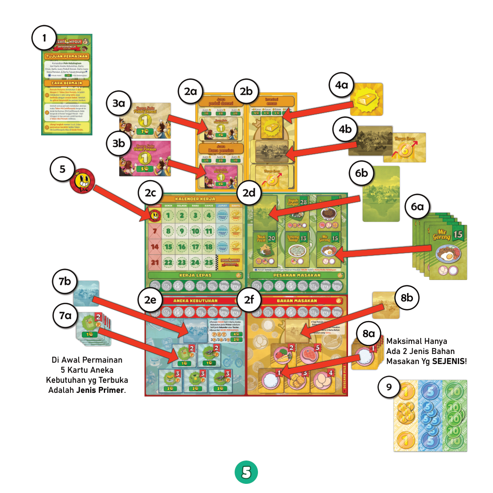
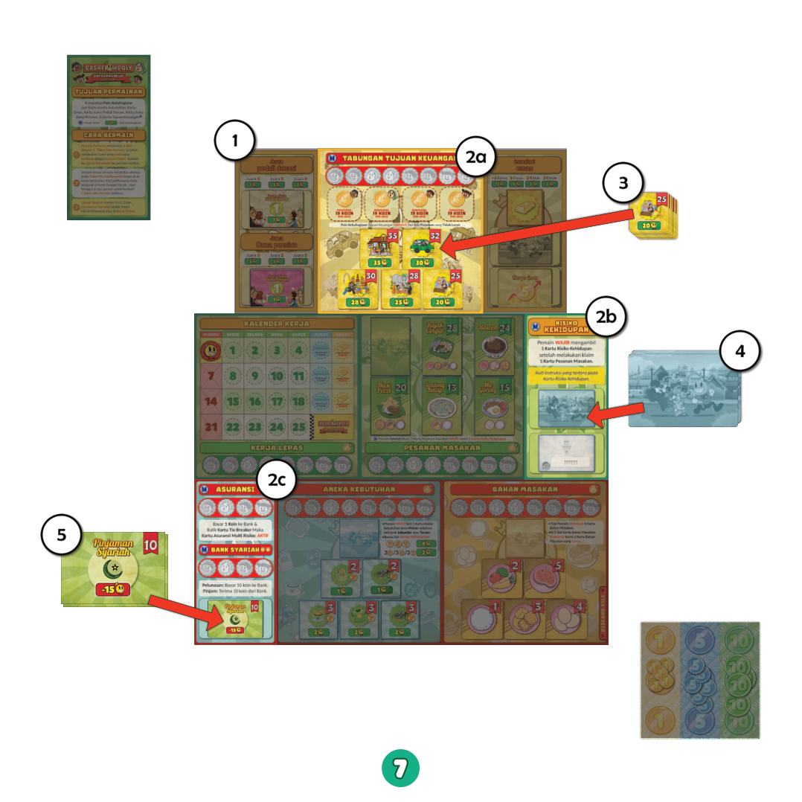
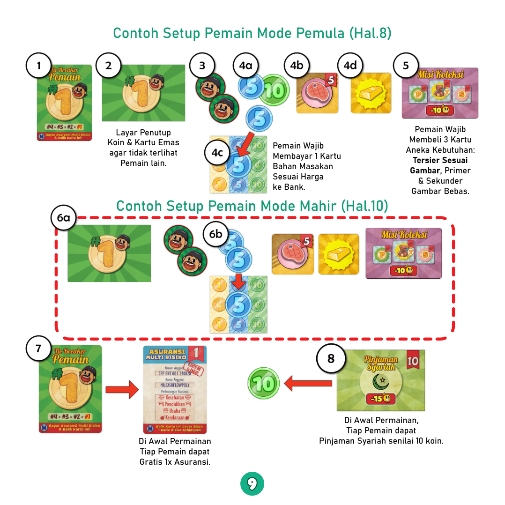
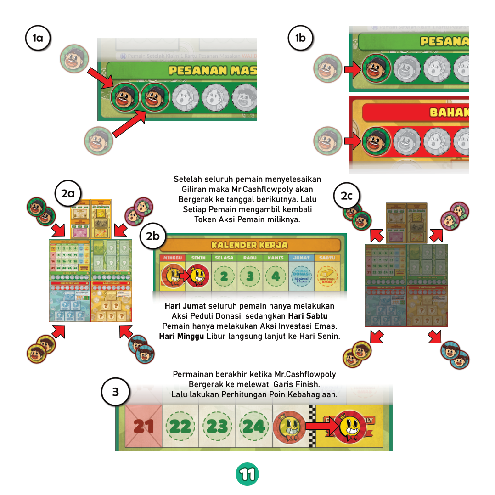
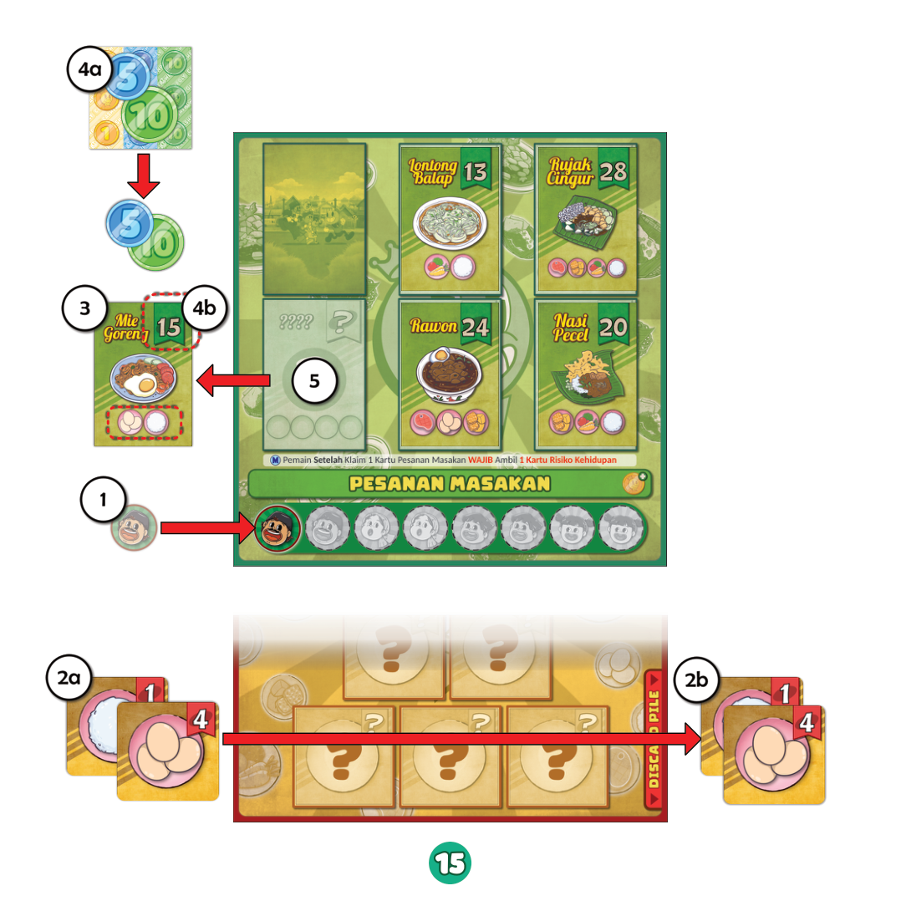
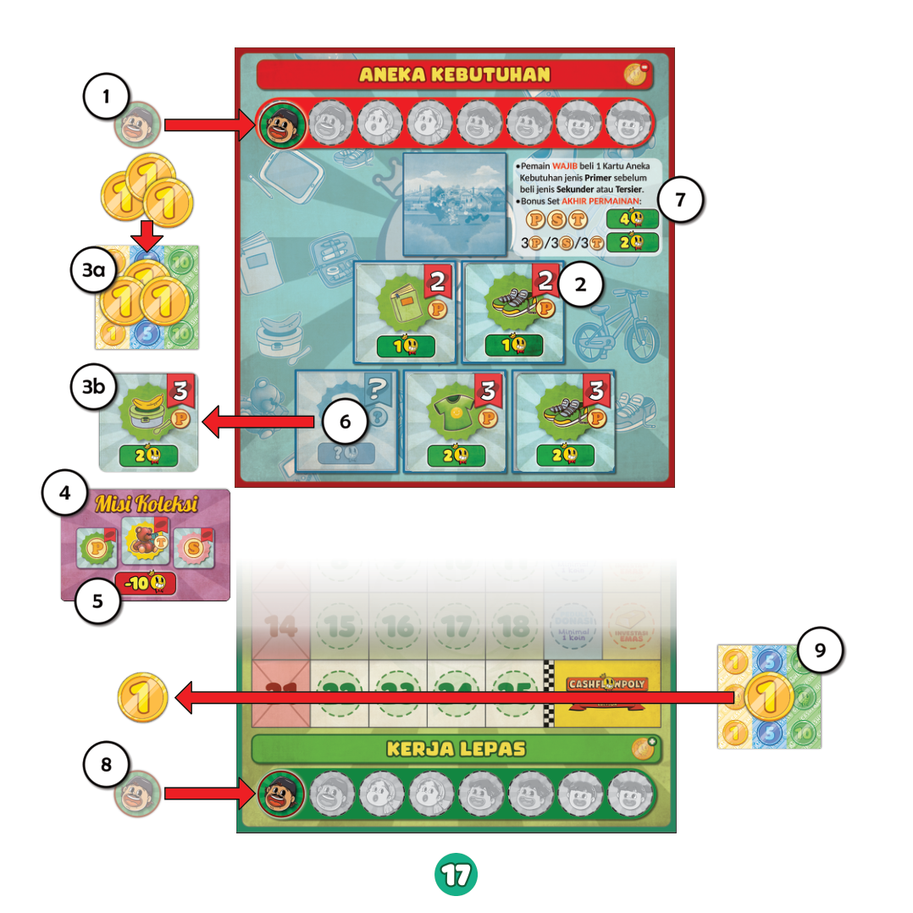
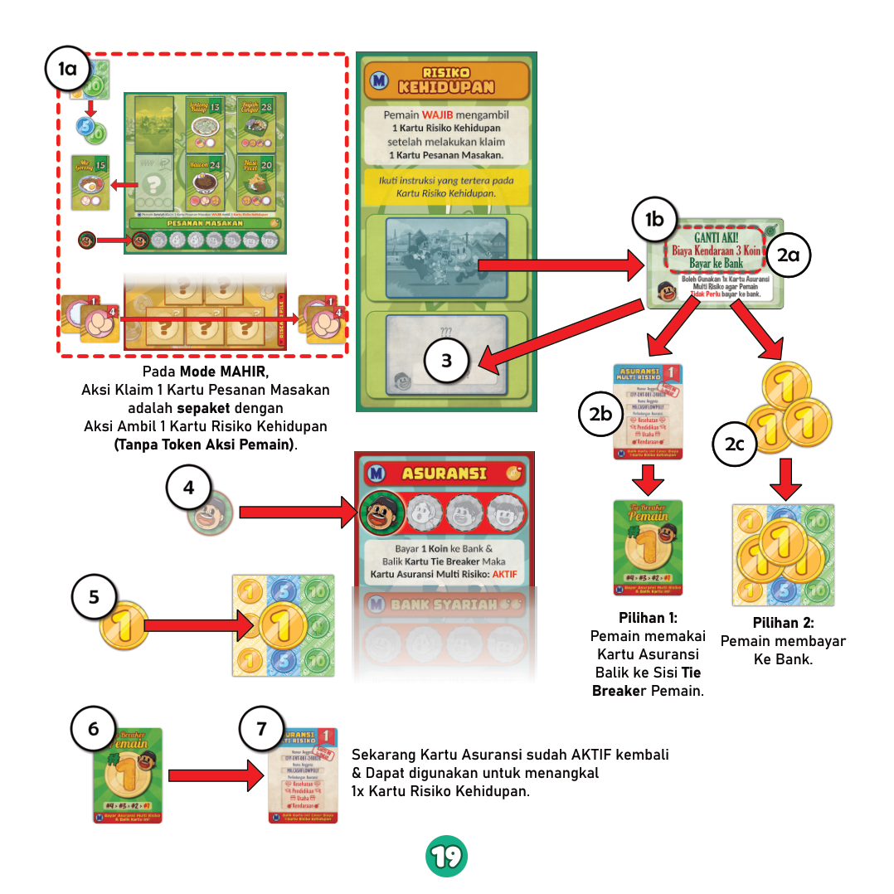
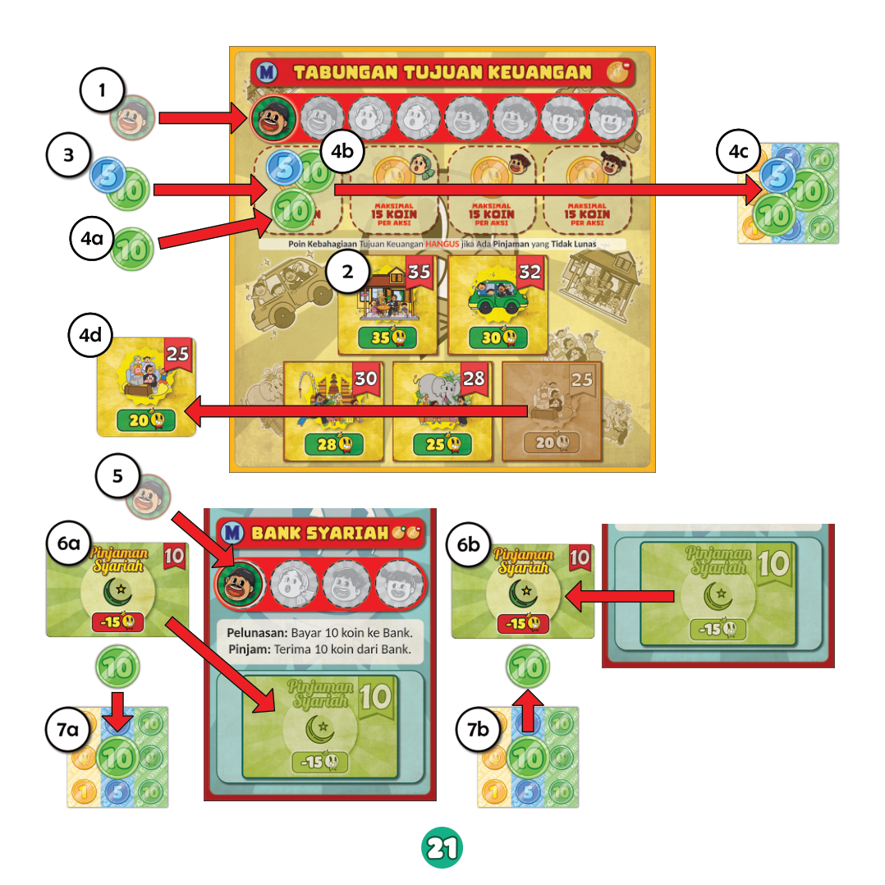
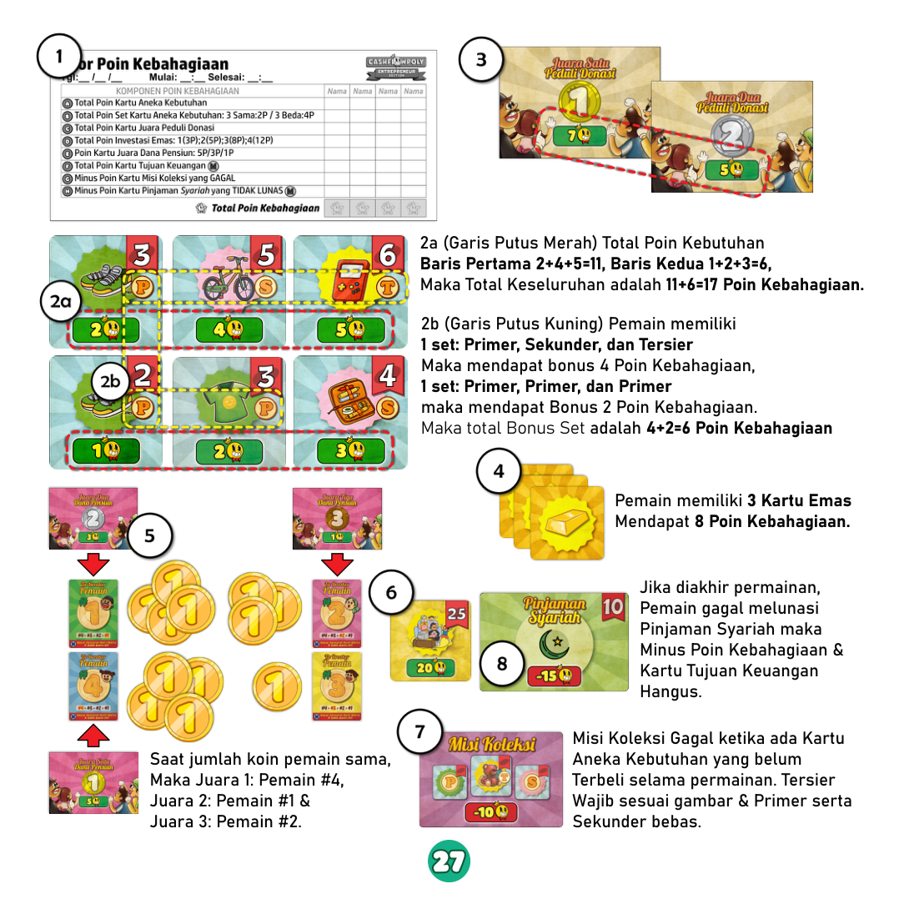
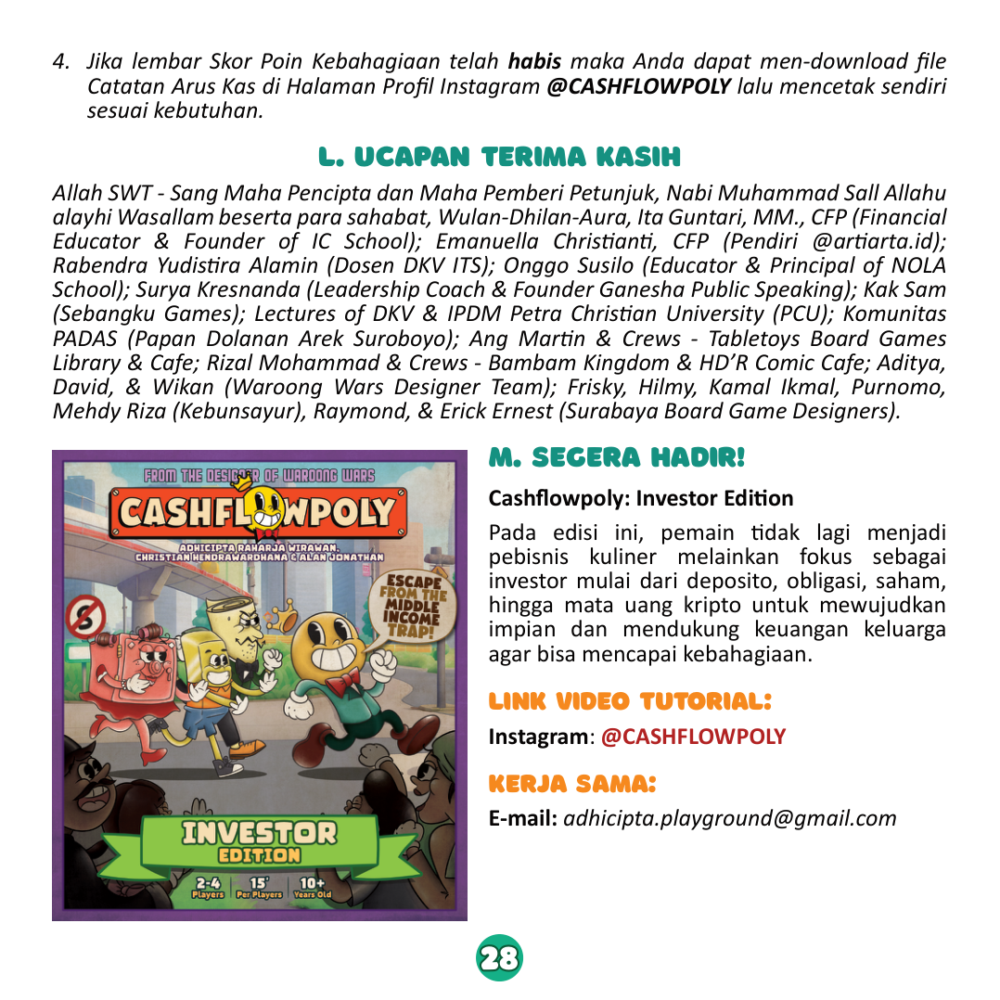

# Ringkasan Mekanika Gim Cashflowpoly – *Entrepreneur Edition*

> Ringkasan ini menyarikan isi *Panduan Permainan Cashflowpoly – Entrepreneur Edition* sebagai dasar analisis kebutuhan sistem dan pemodelan event log.

Bagian 10 menampilkan semua gambar dari *Panduan Permainan* beserta nomor halamannya. Gambar rujukan diambil dari folder `Img/RuleBook`.

## 1. Tujuan Gim dan Konsep Utama

Pemain berperan sebagai individu yang ingin keluar dari *middle‑income trap* dengan cara:

- Mengelola usaha kuliner (memasak dan memenuhi pesanan).
- Mendapat penghasilan sampingan (kerja lepas).
- Berinvestasi pada emas, tabungan tujuan keuangan, dan dana pensiun.
- Mengelola kebutuhan hidup, risiko kehidupan, dan pinjaman syariah.

Pemenang gim ialah pemain dengan **Poin Kebahagiaan** tertinggi di akhir permainan. Poin ini bersumber dari kebutuhan, donasi, investasi emas, dana pensiun, tujuan keuangan, dan penalti atas misi yang gagal.

Gim menyediakan dua tingkat kesulitan:

- **Mode Pemula** – fokus pada alur dasar: usaha kuliner, kebutuhan, donasi, dan emas.
- **Mode Mahir** – menambah tujuan keuangan, risiko kehidupan, asuransi, dan pinjaman syariah.

Lihat Gambar 1 (hal. 1) untuk sampul *rulebook*.

## 2. Komponen Fisik Gim

### 2.1 Komponen Penunjang

- Buku panduan permainan.
- Lembar Skor Poin Kebahagiaan.
- Lembar Catatan Arus Kas (*cashflow sheets*).

### 2.2 Komponen Mode Pemula

- 1 token Mr. Cashflowpoly (marker hari di kalender kerja).
- 8 token aksi pemain (2 per pemain).
- 1 *tent card* Tujuan Permainan.
- Papan:
  - Kalender Kerja.
  - Juara Peduli Donasi.
  - Investasi Emas.
  - Pesanan Masakan.
  - Aneka Kebutuhan.
  - Bahan Masakan.
- 4 layar pemain (penutup koin).
- Kartu:
  - Juara Dana Pensiun.
  - Tie Breaker Pemain / Asuransi Multi Risiko.
  - Misi Koleksi.
  - Harga Emas.
  - Emas.
  - Aneka Kebutuhan.
  - Pesanan Masakan.
  - Bahan Masakan.
- 48 koin (nilai 1, 5, dan 10).

### 2.3 Komponen Mode Mahir (Ekspansi)

Tambahan papan dan kartu:

- Papan Tabungan Tujuan Keuangan.
- Papan Risiko Kehidupan.
- Papan Asuransi & Bank Syariah.
- Kartu Tujuan Keuangan.
- Kartu Pinjaman Syariah.
- Kartu Risiko Kehidupan.

### 2.4 Komponen Lain

- Kotak sebagai “bank” untuk menyimpan koin.
- Tutup kotak sebagai wadah komponen yang tidak dipakai.

## 3. Setup Permainan

### 3.1 Setup Mode Pemula

1. Letakkan *tent card* Tujuan Permainan.
2. Susun papan aksi dalam tiga baris:
   - Baris 1 (poin kebahagiaan): Juara Donasi, Investasi Emas.
   - Baris 2 (penghasilan): Kalender Kerja, Pesanan Masakan.
   - Baris 3 (pengeluaran): Aneka Kebutuhan, Bahan Masakan.
3. Letakkan:
   - Semua Kartu Juara Donasi dan Kartu Dana Pensiun di papan Juara Donasi.
   - Semua Kartu Emas dan dek Kartu Harga Emas di papan Investasi Emas.
4. Tempatkan token Mr. Cashflowpoly di kotak “Go!” pada Kalender Kerja.
5. Buka 5 Kartu Pesanan Masakan di papan Pesanan Masakan; sisa kartu menjadi dek.
6. Buka 5 Kartu Aneka Kebutuhan jenis **primer** di papan Aneka Kebutuhan; sisa kartu menjadi dek.
7. Buka 5 Kartu Bahan Masakan di papan Bahan Masakan. Jika muncul 3 kartu jenis yang sama, buang kartu ketiga ke *discard pile* lalu ganti dengan kartu lain dari dek.
8. Masukkan semua koin ke kotak bank, pisah berdasarkan nominal.

Lihat Gambar 2 (hal. 5) untuk visual susunan papan dan penempatan komponen Mode Pemula.

### 3.2 Setup Mode Mahir

Setup awal sama dengan Mode Pemula, lalu tambahkan:

- Papan Tabungan Tujuan Keuangan di baris poin kebahagiaan.
- Papan Risiko Kehidupan di baris penghasilan.
- Papan Asuransi & Bank Syariah di baris pengeluaran.
- Susun Kartu Tujuan Keuangan di papan tabungan.
- Susun dek Kartu Risiko Kehidupan.
- Letakkan Kartu Pinjaman Syariah di papan Asuransi & Bank Syariah.

Lihat Gambar 3 (hal. 7) untuk visual penambahan papan dan kartu pada Mode Mahir.

### 3.3 Setup Pemain – Mode Pemula

1. **Tentukan pemain pertama** dengan mengocok dan membagikan Kartu Tie Breaker. Pemain dengan nomor tertinggi menjadi pemain pertama; kartu ini kemudian diurutkan kembali sesuai posisi duduk.
2. Berikan kepada setiap pemain:
   - 1 layar pemain.
   - 2 token aksi dengan gambar karakter sesuai kartu tie breaker.
3. Berikan modal awal:
   - 20 koin dari bank.
   - 1 Kartu Bahan Masakan acak; pemain membayar harga bahan tersebut ke bank.
   - 1 Kartu Emas bernilai 5.
4. Berikan 1 Kartu Misi Koleksi secara tertutup kepada tiap pemain. Kartu ini berisi target kombinasi 3 Kartu Aneka Kebutuhan (1 tersier spesifik + 1 primer + 1 sekunder). Kegagalan memenuhi misi akan mengurangi poin di akhir permainan.

Lihat Gambar 4 (hal. 9) untuk contoh setup pemain Mode Pemula dan Mode Mahir.

### 3.4 Setup Pemain – Mode Mahir

Mode Mahir memakai setup Mode Pemula dengan perubahan:

- Kas awal hanya 10 koin.
- Kartu Tie Breaker dibalik menjadi Kartu Asuransi Multi Risiko (aktif).
- Setiap pemain mendapatkan 1 Kartu Pinjaman Syariah senilai 10 koin.

## 4. Alur Giliran dan Kalender Kerja

1. Pada gilirannya, pemain menempatkan **2 token aksi** ke area aksi papan-papan yang tersedia. Pemain boleh memilih dua aksi yang sama atau berbeda.
2. Setelah semua pemain menyelesaikan giliran (masing-masing 2 aksi):
   - Token Mr. Cashflowpoly berpindah ke tanggal berikutnya di Kalender Kerja.
   - Semua pemain mengambil kembali token aksinya.
3. Hari Jumat hanya untuk aksi Peduli Donasi; hari Sabtu hanya untuk aksi Investasi Emas; hari Minggu dilewati.
4. Permainan berakhir ketika Mr. Cashflowpoly mencapai atau melewati kotak Finish. Pemain lalu menghitung Poin Kebahagiaan.

Lihat Gambar 5 (hal. 11) untuk ilustrasi alur giliran, pergerakan Mr. Cashflowpoly, dan aturan Jumat/Sabtu/Minggu.

## 5. Aksi Mode Pemula

### 5.1 Beli 1 Kartu Bahan Masakan

- Pemain menempatkan 1 token aksi pada papan Bahan Masakan.
- Papan menampilkan 5 slot kartu bahan. Maksimal hanya ada 2 kartu bahan sejenis di slot; jika muncul 3 kartu sejenis, buang kartu ketiga ke *discard pile* lalu ganti dari dek.
- Pemain membayar harga bahan ke bank dan mengambil kartu tersebut.
- Batas kepemilikan: maksimal 6 kartu bahan dan paling banyak 3 kartu bahan sejenis.
- Slot kosong diisi dari dek setelah pemain menyelesaikan dua aksi pada gilirannya.
- Jika dek habis, *discard pile* dikocok ulang menjadi dek baru.

Lihat Gambar 6 (hal. 13) untuk contoh slot bahan, area *discard pile*, dan aturan kartu sejenis.

### 5.2 Klaim 1 Kartu Pesanan Masakan

- Pemain menempatkan 1 token aksi pada papan Pesanan Masakan.
- Pemain menyerahkan kombinasi Kartu Bahan Masakan yang disyaratkan; kartu tersebut dibuang ke *discard pile*.
- Pemain menerima penghasilan dari bank sesuai nilai pada Kartu Pesanan Masakan.
- Kartu Pesanan yang sudah dipenuhi disimpan di depan pemain.
- Slot kosong diisi dari dek setelah pemain menyelesaikan dua aksi pada gilirannya.

Lihat Gambar 7 (hal. 15) untuk contoh klaim pesanan, kartu yang masuk *discard pile*, dan arus koin dari bank.

### 5.3 Beli 1 Kartu Aneka Kebutuhan

- Pemain menempatkan 1 token aksi pada papan Aneka Kebutuhan.
- Pemain **wajib** membeli minimal 1 kartu kebutuhan jenis primer sebelum membeli kebutuhan sekunder atau tersier.
- Pemain membayar harga kartu ke bank dan menyimpan kartu di depannya.
- Pemain mengejar target Kartu Misi Koleksi (1 tersier spesifik + 1 primer + 1 sekunder).
- Di akhir permainan, set kebutuhan memberikan bonus:
  - 3 kartu jenis sama → bonus 2 poin.
  - 3 kartu dengan tiga jenis berbeda (P, S, T) → bonus 4 poin.

Lihat Gambar 8 (hal. 17) untuk contoh pembelian kebutuhan dan target misi koleksi.

### 5.4 Kerja Lepas

- Pemain menempatkan 1 token aksi pada papan Kalender Kerja.
- Pemain menerima penghasilan 1 koin dari bank.

Lihat Gambar 8 (hal. 17) untuk posisi aksi Kerja Lepas pada Kalender Kerja.

## 6. Tambahan Aksi Mode Mahir

### 6.1 Risiko Kehidupan

- Di Mode Mahir, setiap kali pemain melakukan Aksi Klaim Pesanan Masakan, pemain juga mengambil 1 Kartu Risiko Kehidupan **tanpa token aksi tambahan**.
- Kartu dapat memicu penghasilan atau pengeluaran.
- Jika memicu pengeluaran, pemain boleh:
  - Menggunakan Kartu Asuransi Multi Risiko yang aktif untuk meniadakan dampak negatif satu kartu, atau
  - Membayar biaya ke bank.
- Jika pemain tidak memiliki koin cukup, ia boleh:
  - Menjual Kartu Aneka Kebutuhan ke bank dengan nilai 1/2 harga beli (dibulatkan ke bawah).
  - Menjual Kartu Emas sesuai harga di Papan Investasi Emas.
  - Menerima 1 Kartu Pinjaman Syariah dan koin 10, yang langsung dikurangi biaya risiko sehingga pemain memperoleh selisihnya.

Lihat Gambar 9 (hal. 19) untuk contoh kartu Risiko Kehidupan, opsi asuransi, dan alur pembayaran.

### 6.2 Asuransi Multi Risiko

- Pemain dapat mengaktifkan kembali kartu Asuransi dengan menempatkan 1 token aksi di Papan Asuransi & Bank Syariah dan membayar 1 koin.
- Asuransi yang aktif dapat digunakan sekali untuk meniadakan dampak negatif 1 Kartu Risiko Kehidupan, lalu kartunya dibalik kembali ke sisi Tie Breaker.

### 6.3 Tabungan Tujuan Keuangan

- Pemain menempatkan 1 token aksi di papan Tabungan Tujuan Keuangan.
- Pemain dapat menabung hingga 15 koin per aksi di atas kartu tabungan miliknya.
- Ketika jumlah tabungan mencapai harga Kartu Tujuan Keuangan yang diinginkan, pemain membayar seluruh tabungan ke bank dan mengambil kartu tujuan tersebut.
- Poin kebahagiaan dari kartu tujuan keuangan **hangus** bila pemain masih memiliki pinjaman syariah yang belum lunas.

Lihat Gambar 10 (hal. 21) untuk contoh tabungan tujuan keuangan dan eksekusi pembelian kartu tujuan.

### 6.4 Pinjaman Syariah

- Pemain menempatkan 1 token aksi di Papan Asuransi & Bank Syariah untuk **meminjam** atau **melunasi** 1 Kartu Pinjaman Syariah.
- Nilai pinjaman pada kartu adalah 10 koin, dan pelunasan juga 10 koin ke bank.
- Di akhir permainan, sisa Pinjaman Syariah yang belum lunas menyebabkan:
  - Kartu Tujuan Keuangan tidak memberikan poin (hangus).
  - Pemain mendapat penalti **-15 poin** per kartu pinjaman yang tidak lunas.

Lihat Gambar 10 (hal. 21) untuk contoh mekanisme pinjam dan pelunasan pinjaman syariah.

## 7. Aksi Bebas (Tanpa Token Aksi)

### 7.1 Peduli Donasi (Hari Jumat)

- Saat Mr. Cashflowpoly berada di kotak Jumat pada Kalender Kerja, semua pemain melakukan donasi secara rahasia.
- Pemain menggenggam sejumlah koin (minimal 1) lalu membukanya bersamaan.
- Peringkat donasi ditentukan berdasarkan total koin; jika terjadi seri, kartu Tie Breaker dengan nomor lebih besar menang.
- Pemain menerima Kartu Juara Donasi dengan nilai poin:
  - Juara 1: 7 poin.
  - Juara 2: 5 poin.
  - Juara 3: 2 poin.
- Semua koin donasi diserahkan ke bank.

Lihat Gambar 11 (hal. 23) untuk ilustrasi donasi rahasia dan penentuan juara donasi.

### 7.2 Investasi Emas (Hari Sabtu)

- Saat Mr. Cashflowpoly berada di kotak Sabtu, semua pemain boleh membeli atau menjual Kartu Emas.
- Buka 1 Kartu Harga Emas untuk menentukan harga beli dan jual saat itu.
- Giliran transaksi dimulai dari pemain pertama lalu berlanjut searah jarum jam.
- Pemain tidak dibatasi jumlah Kartu Emas yang dibeli atau dijual.
- Aksi investasi emas juga dapat muncul dari Kartu Risiko Kehidupan khusus.

Lihat Gambar 11 (hal. 23) untuk ilustrasi transaksi beli/jual emas berbasis kartu harga.

## 8. Catatan Arus Kas (Opsional)

- Setiap pemain dapat menggunakan Lembar Catatan Arus Kas untuk mencatat pemasukan dan pengeluaran harian selama permainan.
- Pemain mencatat:
  - Tanggal transaksi.
  - Transaksi pemasukan (+).
  - Transaksi pengeluaran (–).
- Di akhir permainan, pemain menghitung:
  - Saldo awal.
  - Total pemasukan.
  - Total pengeluaran.
  - Saldo akhir.

Lihat Gambar 12 (hal. 25) untuk format lembar catatan arus kas.

## 9. Perhitungan Poin Kebahagiaan

Di akhir permainan, pemain menjumlahkan poin berdasarkan kategori berikut:

1. **Poin Kartu Aneka Kebutuhan** – total poin yang tercetak pada semua kartu kebutuhan milik pemain.
2. **Bonus Set Aneka Kebutuhan** – kombinasi 3 kartu:
   - 3 kartu kebutuhan jenis sama → +2 poin per set.
   - 3 kartu kebutuhan dengan tiga jenis berbeda → +4 poin per set.
3. **Poin Juara Peduli Donasi** – total poin dari Kartu Juara Donasi (7/5/2 poin untuk juara 1–3).
4. **Poin Investasi Emas** – berdasarkan jumlah Kartu Emas yang dimiliki:
   - 1 emas → 3 poin
   - 2 emas → 5 poin
   - 3 emas → 8 poin
   - 4 emas → 12 poin
5. **Poin Juara Dana Pensiun** – peringkat jumlah koin tersisa (termasuk penjualan sisa bahan, sisa tabungan, dan saldo):
   - Juara 1: 5 poin
   - Juara 2: 3 poin
   - Juara 3: 1 poin  
   Peringkat imbang dipecahkan oleh nomor Tie Breaker.
6. **Poin Kartu Tujuan Keuangan** (Mode Mahir) – hanya berlaku bila semua Pinjaman Syariah sudah lunas.
7. **Minus Poin Kartu Misi Koleksi** – jika misi tidak terpenuhi, penalti **-10 poin**.
8. **Minus Poin Pinjaman Syariah** – penalti **-15 poin** untuk setiap kartu pinjaman yang belum lunas.

Jika terjadi seri pada total Poin Kebahagiaan, pemain dengan nomor Tie Breaker lebih besar menjadi pemenang.

---

Dokumen markdown ini dapat menjadi referensi utama untuk:

- Menyusun spesifikasi kebutuhan fungsional sistem pencatat event.
- Mendesain struktur event log (jenis aksi, aktor, parameter).
- Menurunkan aturan perhitungan metrik dan poin kebahagiaan ke dalam modul analitik.
Lihat Gambar 13 (hal. 27) untuk contoh penghitungan poin kebahagiaan, set kebutuhan, emas, misi, dan tie breaker.

Lihat Gambar 14 (hal. 28) untuk pengumuman *Cashflowpoly: Investor Edition*.

## 10. Lampiran Gambar Rulebook dan Nomor Halaman

Bagian ini memuat semua halaman bergambar dari PDF agar Anda bisa menautkan gambar ke referensi halaman secara konsisten.

### Gambar 1 — Sampul *rulebook* (Hal. 1)

### Gambar 2 — Setup awal Mode Pemula (Hal. 5)

### Gambar 3 — Setup awal Mode Mahir (Hal. 7)

### Gambar 4 — Contoh setup pemain Mode Pemula dan Mode Mahir (Hal. 9)

### Gambar 5 — Alur giliran dan pergerakan Kalender Kerja (Hal. 11)

### Gambar 6 — Aksi beli kartu bahan masakan dan *discard pile* (Hal. 13)

### Gambar 7 — Aksi klaim kartu pesanan masakan (Hal. 15)

### Gambar 8 — Aksi beli kartu aneka kebutuhan dan kerja lepas (Hal. 17)

### Gambar 9 — Risiko kehidupan dan asuransi multi risiko (Hal. 19)

### Gambar 10 — Tabungan tujuan keuangan dan bank syariah (Hal. 21)

### Gambar 11 — Peduli donasi dan investasi emas (Hal. 23)

### Gambar 12 — Template lembar catatan arus kas (Hal. 25)

### Gambar 13 — Contoh perhitungan poin kebahagiaan (Hal. 27)

### Gambar 14 — Pengumuman *Cashflowpoly: Investor Edition* (Hal. 28)

