# Alur Lengkap Project Cashflowpoly Analytics Platform

Dokumen ini adalah peta alur menyeluruh untuk memahami project Cashflowpoly Analytics Platform dari ujung ke ujung: rulebook fisik, ruleset, setup sesi, event gameplay, validasi, database, projection, analitika, UI, pengujian, dan deployment.

**Tanggal ringkasan: 19 Agustus 2026. Baseline schema: 3.0.11.**

## 1. Ringkasan Besar

Cashflowpoly Analytics Platform adalah sistem event-first untuk mencatat permainan papan Cashflowpoly, memvalidasi aksi pemain berdasarkan ruleset, menyimpan event ke PostgreSQL, membangun state turunan, menghitung metrik pembelajaran, lalu menampilkannya di Web Analitik MVC.

**Prinsip paling penting:**
- Permainan berjalan di papan fisik atau Klien Game/IDN.
- Semua aksi permainan dikirim sebagai event ke API.
- Tabel events adalah sumber kebenaran gameplay.
- State, saldo, inventory, market, skor, dan metric adalah projection/cache dari event.
- Sesi mengunci satu ruleset_version_id.
- UI tidak menulis state gameplay langsung. UI membaca API dan mengelola ruleset.

**Alur satu kalimat:**

```
Rulebook -> Ruleset -> Session -> Players -> Setup Cards -> Events -> Validation -> Events DB -> Projection -> Metrics -> API -> UI Dashboard
```

## 2. Komponen Sistem

| Komponen | Lokasi | Fungsi |
| --- | --- | --- |
| Rulebook ringkas | docs/00-ringkasan-rulebook-cashflowpoly.md | Referensi aturan permainan fisik. |
| Kartu fisik digital | src/Cashflowpoly.Ui/wwwroot/images/component | Gambar komponen kartu permainan. |
| Manifest kartu | src/Cashflowpoly.Ui/wwwroot/images/component/component-image-manifest.csv | Pemetaan gambar asli ke nama komponen. |
| Tabel komponen gambar | docs/component-rulebook-image-table.md | Tabel audit komponen berdasarkan gambar. |
| Schema DB | database/00_create_schema.sql | DDL kanonis PostgreSQL. |
| Seed ruleset | database/01_seed_default_rulesets_components.sql | Ruleset default, action catalog, komponen gameplay. |
| Seed simulasi | database/02_seed_simulation_sessions_events.sql | Data contoh sesi dan event manual. Tidak auto-bootstrap. |
| API | src/Cashflowpoly.Api | REST API, auth, validasi event, projection, analytics. |
| UI | src/Cashflowpoly.Ui | Web Analitik MVC/Razor. |
| Tests | tests/Cashflowpoly.Api.Tests, tests/Cashflowpoly.Ui.Tests | Unit/integration/regression tests. |
| Infra | infra/docker, infra/nginx, infra/cloudflared | Docker Compose, reverse proxy, tunnel. |

## 3. Aktor dan Hak Akses

| Aktor | Hak utama | Batasan |
| --- | --- | --- |
| Guest | Login/register, melihat rulebook publik | Tidak bisa baca data sesi. |
| INSTRUCTOR | Membuat ruleset, membuat sesi via API/IDN, menambah player, mulai/akhir sesi, kirim event, melihat semua analitika sesi miliknya | Tidak boleh mengubah ruleset default atau ruleset yang sudah terkunci sesi. |
| PLAYER | Melihat sesi yang ia ikuti, melihat metrik dan transaksi dirinya sendiri, mengirim event untuk dirinya sendiri jika client mengizinkan | Tidak bisa melihat data player lain, audit security, atau mutasi ruleset/sesi. |
| Sistem/Simulator | Mengirim event setup, event ranking, event akhir sesi, seed simulasi | Harus tetap membawa ruleset_version_id dan sequence yang valid. |

**Identitas penting:**

| Istilah | Makna |
| --- | --- |
| user_id | ID akun di app_users. Dipakai oleh INSTRUCTOR dan PLAYER. |
| session_participant_id | ID peserta di dalam sesi. |
| session_player_id | Alias kontrak API untuk session_participant_id. |
| player_order_no | Nomor urutan pemain dalam sesi. |
| ruleset_id | Wadah ruleset. |
| ruleset_version_id | Versi ruleset yang dikunci oleh sesi dan wajib ada di event. |

## 4. Arsitektur Tingkat Tinggi

```
Browser UI MVC
-> Cashflowpoly.Ui
-> HttpClient Bearer Token
-> Cashflowpoly.Api
-> PostgreSQL
Klien Game/IDN atau Simulator
-> REST API /api/v1/events
-> Validasi + Projection
-> PostgreSQL
-> Analytics API
-> UI Dashboard
```

**Diagram alur:**

```mermaid
flowchart LR
Rulebook[Rulebook Fisik] --> Seed01[Seed Ruleset Default]
Seed01 --> Ruleset[Ruleset Version]
Ruleset --> Session[Sesi Mengunci Ruleset]
Session --> Participants[Session Participants]
Participants --> GameClient[Klien Game/IDN atau Simulator]
GameClient --> EventsApi[POST /api/v1/events]
EventsApi --> Validators[Validasi Shape, Auth, Scope, Sequence, Domain]
Validators --> Events[(events)]
Validators --> ValidationLogs[(validation_logs)]
Events --> Projector[SessionEventProjector]
Projector --> State[(session state/projections)]
Events --> Analytics[AnalyticsService]
State --> Analytics
Analytics --> Snapshots[(metric_snapshots)]
Snapshots --> Dashboard[Web Analitik MVC]
```



## 5. Alur Bootstrap Aplikasi

**Saat Cashflowpoly.Api startup:**
- API membaca ConnectionStrings:Default.
- API memvalidasi konfigurasi JWT.
- API menjalankan database/00_create_schema.sql.
- API menjalankan database/01_seed_default_rulesets_components.sql.
- API opsional membuat user bootstrap jika AuthBootstrap:SeedDefaultUsers=true.

**API membuka endpoint:**
- /api/v1/...
- /health/live
- /health/ready
- /metrics
- /swagger hanya development.

**Catatan:**
- database/02_seed_simulation_sessions_events.sql tidak dijalankan otomatis oleh startup.
- Jika schema tidak didukung terdeteksi, startup meminta reset database.
- File SQL dicari dari konfigurasi DatabaseBootstrap:SqlDirectory, artifacts/runtime-sql, atau folder database.

## 6. Alur Auth dan Session Login

## 6.1 Register/Login API

**Endpoint publik:**

| Endpoint | Fungsi |
| --- | --- |
| POST /api/v1/auth/register | Registrasi publik akun PLAYER; akun INSTRUCTOR dibuat melalui bootstrap/admin. |
| POST /api/v1/auth/login | Mengembalikan JWT dan data user. |

**Setelah login:**
- API memverifikasi password hash.
- API menerbitkan JWT berisi user_id, username, role, display_name.
- UI menyimpan token di server-side session.
- BearerTokenHandler UI menempelkan token ke request API berikutnya.

## 6.2 Guard UI

Cashflowpoly.Ui mengizinkan route publik:
- /auth/login
- /auth/register
- /language
- /health/...
- /rulebook
- static assets

Route lain akan redirect ke login bila cookie autentikasi terenkripsi UI tidak memiliki role/token yang valid.

## 7. Alur Ruleset

Ruleset adalah konfigurasi permainan yang bisa berubah tanpa mengubah kode.

## 7.1 Struktur ruleset

```
rulesets
-> ruleset_versions
-> ruleset_game_settings
-> ruleset_actions
-> ruleset_game_assets
-> ruleset_ingredients
-> ruleset_orders
-> ruleset_needs
-> ruleset_collection_missions
-> ruleset_financial_goals
-> ruleset_gold_prices
-> ruleset_gold_assets
-> ruleset_sharia_loans
-> ruleset_insurance_products
-> ruleset_life_risks
```

## 7.2 Lifecycle ruleset

| Status | Makna |
| --- | --- |
| DRAFT | Versi disiapkan, belum aktif. |
| ACTIVE | Versi aktif untuk ruleset tersebut. |
| ARCHIVED | Versi lama yang tidak dipakai sesi baru. |

**Aturan:**
- Satu ruleset bisa punya banyak versi.
- Satu ruleset hanya boleh punya satu versi aktif.
- Sesi baru memilih ruleset_version_id aktif.
- Setelah sesi dibuat, versi ruleset tidak boleh diganti.
- Ruleset default read-only.
- Ruleset/version yang sudah dipakai sesi tidak boleh dihapus.

## 7.3 Endpoint ruleset

| Endpoint | Akses | Fungsi |
| --- | --- | --- |
| GET /api/v1/rulesets | Instructor/Player | Daftar ruleset sesuai scope. |
| GET /api/v1/rulesets/{rulesetId} | Instructor/Player | Detail ruleset dan versi. |
| GET /api/v1/rulesets/{rulesetId}/components?version=... | Instructor/Player | Komponen ruleset. |
| GET /api/v1/rulesets/components/defaults?mode=... | Instructor/Player | Komponen default. |
| POST /api/v1/rulesets | Instructor | Buat ruleset dan versi awal. |
| PUT /api/v1/rulesets/{rulesetId} | Instructor | Buat versi baru. |
| POST /api/v1/rulesets/{rulesetId}/versions/{version}/activate | Instructor | Aktifkan versi. |
| DELETE /api/v1/rulesets/{rulesetId}/versions/{version} | Instructor | Hapus versi nonaktif yang belum dipakai. |
| DELETE /api/v1/rulesets/{rulesetId} | Instructor | Hapus ruleset non-default yang belum terkunci. |

## 8. Ruleset Default Berdasarkan Rulebook

## 8.1 Mode Pemula

| Parameter | Nilai |
| --- | --- |
| Mode | PEMULA |
| Kas awal | 20 koin |
| Aksi per pemain per hari | 2 |
| Hari selesai | 25 |
| Pemain | 2-4 |
| Max bahan total di tangan | 6 |
| Max bahan sejenis | 3 |
| Slot market bahan | 5 |
| Slot market pesanan | 5 |
| Slot market kebutuhan | 5 |
| Bahan awal per pemain | 1 kartu, bayar harga kartu |
| Emas awal per pemain | 1 kartu |
| Misi koleksi awal | 1 kartu |
| Tie breaker awal | 1 kartu |
| Pinjaman/asuransi/tabungan tujuan | Tidak aktif |

## 8.2 Mode Mahir

| Parameter | Nilai |
| --- | --- |
| Mode | MAHIR |
| Kas awal | 10 koin |
| Fitur tambahan | Risiko, pinjaman syariah, asuransi, tabungan tujuan keuangan |
| Pinjaman awal | 1 Pinjaman Syariah 10 per pemain |
| Asuransi awal | 1 proteksi aktif gratis per pemain |
| Batas setor tabungan | Maksimal 15 koin per aksi |
| Tujuan keuangan | 25/20, 28/25, 30/28, 32/30, 35/35 |

## 8.3 Hari khusus

| Hari | Aturan |
| --- | --- |
| Senin-Kamis | Pemain memakai 2 token aksi normal. |
| Jumat | Fokus donasi/peduli donasi. |
| Sabtu | Fokus harga emas dan transaksi emas. |
| Minggu | Libur, tidak ada aksi pemain. |

## 8.4 Market awal

**Setup market awal:**

| Market | Slot |
| --- | --- |
| Bahan Masakan | 5 slot |
| Pesanan Masakan | 5 slot |
| Aneka Kebutuhan | 5 slot, awal berupa kebutuhan primer |

**session_card_positions menyimpan posisi kartu (fisik untuk non-bahan, logis untuk bahan):**

```
DECK -> MARKET -> PLAYER -> DISCARD
```

**Untuk risiko:**

```
RISK_DECK -> PLAYER/RESOLVED -> DISCARD
```

## 9. Alur Lifecycle Sesi

## 9.1 Buat sesi

- Instruktur login.
- Instruktur memilih ruleset aktif.
- Klien Game/IDN memanggil POST /api/v1/sessions.

**API memvalidasi:**
- role harus INSTRUCTOR,
- ruleset ada,
- versi ruleset aktif,
- mode session sama dengan mode ruleset.

- API membuat row sessions dengan status CREATED.
- sessions.ruleset_version_id terkunci.

## 9.2 Tambah pemain

- Instruktur memilih akun PLAYER.
- Klien memanggil POST /api/v1/sessions/{sessionId}/players.
- API membuat/menjaga session_participants.

**API memastikan:**
- user role PLAYER,
- player_order_no unik,
- jumlah player tidak melewati batas ruleset.

## 9.3 Mulai sesi

- Klien memanggil POST /api/v1/sessions/{sessionId}/start.
- API memvalidasi minimal tiga jenis bahan, lima kartu pesanan, lima kebutuhan Primer, misi unik yang cukup, serta Tie Breaker unik `#1..#N`.
- API mengocok dan membagikan Tie Breaker `#1..#N`; pemilik `#1` menjadi pemain pertama dan `player_order_no` peserta diperbarui secara atomik mengikuti nomor kartu.
- API mengacak bahan awal, misi, serta isi pasar awal. Pasar kebutuhan berisi tepat lima kartu Primer.
- API mengubah status CREATED -> STARTED dan menyimpan pemain pemilik Tie Breaker `#1` sebagai pemain aktif pertama.
- Sesi siap menerima event.

## 9.4 Setup gameplay

**Setup dicatat sebagai event sistem agar hasil acak dapat diaudit dan direplay:**

| Event | Actor | Fungsi |
| --- | --- | --- |
| BagikanTieBreaker | SYSTEM | Memberi kartu tie breaker/player order. |
| SetupMisiAwal | SYSTEM | Memberi misi koleksi unik. |
| SetupBahanAwal | SYSTEM | Memberi bahan awal dan mencatat biaya berdasarkan harga kartu. |
| SetupEmasAwal | SYSTEM | Memberi 1 emas awal. |
| SetupPinjamanAwal | SYSTEM | Mode Mahir: memberi pinjaman awal 10. |
| SetupAsuransiAwal | SYSTEM | Mode Mahir: memberi proteksi gratis. |
| AmbilKartuDariDeck | SYSTEM | Mencatat hasil pengisian market awal. |

Selama sesi aktif, payload `SetupMisiAwal` hanya dibuka untuk Instruktur dan pemain pemilik misi. Pemain lain menerima `{ "status": "HIDDEN" }`; setelah sesi berstatus `ENDED`, seluruh misi dapat dibaca.

## 9.5 Gameplay harian

**Pada hari biasa:**
- Player 1 menjalankan aksi slot 1 dan 2.
- Player 2 menjalankan aksi slot 1 dan 2.
- Player 3 menjalankan aksi slot 1 dan 2.
- Player 4 menjalankan aksi slot 1 dan 2.
- Setelah aksi reguler terakhir setiap pemain, server mengisi semua slot pasar kosong dalam transaksi yang sama. Hasil acak disimpan pada `payload.market_refills` milik event aksi tersebut sehingga replay tetap deterministik.
- Klien tidak mengirim event draw/refill manual ketika sesi berjalan.
- Sistem mengirim/menyimpan event akhir giliran/perpindahan hari.
- Mr. Cashflowpoly maju ke tanggal berikutnya.

**Pada Jumat:**
- Semua pemain melakukan JumatBerkah.
- Sistem menentukan rank donasi.
- Sistem mencatat PoinPeringkatDonasi.
- Sistem bisa mencatat UmumkanJuaraDonasi.

**Pada Sabtu:**
- Sistem membuka harga emas aktif untuk hari tersebut.
- Pemain boleh InvestasiEmas, JualEmas, atau LewatiTransaksiEmas.
- Transaksi emas normal wajib hari Sabtu.
- Risiko GOLD_TRADE bisa memicu transaksi emas di luar Sabtu.

**Pada Minggu:**
- Sistem mencatat HariMingguLibur.
- Tidak ada aksi pemain.

## 9.6 Akhiri sesi

- Klien memanggil POST /api/v1/sessions/{sessionId}/end.
- API mengubah status STARTED -> ENDED.
- Projector menandai misi yang tidak lengkap sebagai gagal.
- Skor akhir dapat dihitung dan disimpan.
- Event baru setelah sesi selesai harus ditolak.

## 10. Katalog Event Gameplay

## 10.1 Event umum

| Event | Fungsi |
| --- | --- |
| MulaiSesi | Menandai awal sesi. |
| AkhiriSesi | Menandai akhir sesi. |
| AkhirGiliran | Menandai progres giliran/hari. |
| HariMingguLibur | Mencatat hari Minggu tanpa aksi pemain. |

## 10.2 Event aksi Pemula

| Event | Fungsi |
| --- | --- |
| BahanMasakan | Membeli/menerima bahan. |
| BuangBahanMasakan | Membuang bahan dari inventory. |
| JualMasakan | Klaim pesanan dan menerima koin. |
| LewatiOrder | Melewati pesanan yang tersedia. |
| Kebutuhan | Membeli kebutuhan dan memperoleh poin kebutuhan. |
| KerjaLepas | Menerima 1 koin. |
| JumatBerkah | Donasi hari Jumat. |
| InvestasiEmas | Beli emas. |
| JualEmas | Jual emas. |
| LewatiTransaksiEmas | Tidak transaksi emas saat giliran emas. |

## 10.3 Event setup/skor

| Event | Fungsi |
| --- | --- |
| SetupEmasAwal | Memberi emas awal. |
| BagikanTieBreaker | Memberi tie breaker. |
| SetupMisiAwal | Memberi misi koleksi. |
| PoinPeringkatDonasi | Memberi poin rank donasi. |
| UmumkanJuaraDonasi | Log ringkasan pemenang donasi. |
| PoinEmas | Memberi poin emas. |
| PoinPeringkatPensiun | Memberi poin dana pensiun. |

## 10.4 Event Mode Mahir

| Event | Fungsi |
| --- | --- |
| RisikoKehidupan | Mengambil/menjalankan risiko setelah jual masakan. |
| BayarRisiko | Membayar risiko `OUT` pending secara tunai. |
| Asuransi | Membeli asuransi atau memakai asuransi pada risiko. |
| PinjamanSyariah | Mengambil/menerima pinjaman 10. |
| BayarPinjaman | Melunasi pinjaman. |
| Menabung | Setor tabungan tujuan, maksimal 15 koin per aksi. |
| TarikTabungan | Menarik saldo tabungan tujuan. |
| TujuanFinansial | Aksi pemain untuk memperoleh tujuan finansial saat prasyarat terpenuhi. |
| GunakanOpsiDarurat | Menutup risiko dengan opsi darurat. |

**Catatan rulebook:**
- Implementasi digital menyediakan `TarikTabungan` dan `TujuanFinansial` sebagai aksi reguler pemain yang memakai token aksi.

## 11. Struktur Event API

Setiap event minimal membawa:

| Field | Wajib | Fungsi |
| --- | --- | --- |
| event_id | Ya | UUID stabil untuk idempotensi. |
| session_id | Ya | Sesi target. |
| user_id | Ya untuk player | Akun player. Kosong untuk event sistem. |
| actor_type | Ya | PLAYER atau SYSTEM. |
| timestamp | Ya | Waktu event. |
| day_index | Ya | Index hari, mulai 0. |
| weekday | Ya | MON sampai SUN. |
| turn_number | Ya | Nomor giliran. |
| action_slot | Ya | Slot 0 untuk event sistem/aksi gratis; slot 1..N untuk aksi reguler pemain. |
| action_type | Ya | Nama event/action. |
| sequence_number | Ya | Urutan event per sesi. |
| ruleset_version_id | Ya | Harus cocok dengan sesi. |
| payload | Ya | Detail domain event. |
| client_request_id | Tidak | Tracing request. |

## 12. Alur Ingestion Event

**Endpoint:**
- POST /api/v1/events
- POST /api/v1/events/batch

**Alur internal:**

```
Request Event
-> EventRequestShapeValidator
-> Auth/RBAC/Scope Session
-> Resolve Session Participant
-> Check Session Status
-> Check ruleset_version_id
-> Check sequence_number
-> Check duplicate event_id
-> Resolve action_id
-> Domain Validators
-> Cashflow Projection Builder
-> Store events
-> Store event_asset_references
-> Store event_cashflow_projections
-> SessionEventProjector
-> metric/recompute later
```

**Jika valid:**
- Event masuk ke events.
- Asset yang dirujuk masuk ke event_asset_references.
- Arus kas hasil event masuk ke event_cashflow_projections.
- Projector memperbarui state/projection terkait.
- API mengembalikan 201 Created.

**Jika invalid:**
- Event tidak masuk ke events.
- Request dicatat di validation_logs.
- API mengembalikan 400, 403, 409, atau 422.

## 13. Lapisan Validasi

| Lapisan | Yang dicek |
| --- | --- |
| Shape | Field wajib, enum, payload dasar. |
| Auth | JWT valid, role ada, token belum expired. |
| Scope | Instructor hanya sesi miliknya; Player hanya dirinya sendiri. |
| Session | Sesi ada, status benar, participant valid. |
| Idempotensi | (session_id, event_id) tidak duplikat. |
| Urutan | sequence_number tidak lompat dan tidak mundur. |
| Ruleset | ruleset_version_id cocok dengan sesi. |
| Action | action_type resolve ke ruleset_actions. |
| Domain | Aturan bahan, order, kebutuhan, Jumat, Sabtu, emas, pinjaman, asuransi, risiko, tabungan. |
| Saldo | Pengeluaran tidak boleh membuat saldo di bawah batas ruleset. |

**Contoh validasi domain:**
- BahanMasakan: total bahan tidak melebihi 6 dan bahan sejenis tidak melebihi 3.
- BahanMasakan/Kebutuhan/JualMasakan: kartu target wajib sedang terbuka pada market yang sesuai.
- JualMasakan: pemain harus punya bahan yang cukup.
- Kebutuhan: points wajib ada; prasyarat Primer dilihat dari riwayat pembelian sepanjang sesi walaupun kartu Primer kemudian dijual.
- JumatBerkah: weekday harus FRI, nominal dalam batas.
- JumatBerkah: maksimal satu donasi per pemain pada hari yang sama.
- InvestasiEmas/JualEmas: weekday harus SAT kecuali dipicu risiko emas, dan harga harus berasal dari `BukaHargaEmas` pada hari yang sama.
- JualEmas: kuantitas dibaca dari `session_participant_gold_holdings`.
- RisikoKehidupan: merujuk `JualMasakan` melalui `source_order_event_id`; risiko `OUT` tetap pending sampai diselesaikan.
- GunakanOpsiDarurat: hanya `SELL_NEED`, `SELL_GOLD`, atau `TAKE_SHARIA_LOAN`; nominal dihitung server dan aset/utang diperbarui atomik.
- PinjamanSyariah: detail sesuai katalog, setiap kartu memakai `loan_instance_id`, dan total instance aktif dibatasi stok fisik `card_qty` per sesi.
- BayarPinjaman: wajib melunasi seluruh outstanding.
- Asuransi: premium sesuai katalog; penggunaan hanya melalui event `Asuransi` dengan `risk_event_id`, memerlukan polis `ACTIVE` dengan `remaining_uses > 0`, dan mengurangi tepat satu penggunaan secara atomik.
- Menabung: amount > 0 dan maksimal 15.
- TarikTabungan/TujuanFinansial: aksi reguler pemain dan memakai slot aksi.

## 14. Projection dan State

Projection utama:

| Projection | Tabel |
| --- | --- |
| State sesi | session_states |
| Saldo peserta | session_participant_balances |
| Inventory bahan | session_participant_inventory |
| Pembelian kebutuhan | session_participant_need_purchases |
| Misi koleksi | session_participant_collection_missions |
| Tujuan keuangan | session_participant_financial_goals |
| Aksi per peserta | session_participant_action_counters |
| Kepemilikan emas | session_participant_gold_holdings |
| Pinjaman | session_participant_loans |
| Asuransi | session_participant_insurances |
| Tie breaker | session_participant_tie_breakers |
| Posisi kartu fisik | session_card_positions |
| Donasi | session_donation_events |
| Cashflow | event_cashflow_projections |
| Checkpoint replay | session_projection_checkpoints |

**Aturan:**
- Projection harus bisa dibangun ulang dari events.
- Projection menyimpan provenance event (last_event_id atau source_event_id) jika tersedia.
- PUT /api/v1/sessions/{sessionId}/state sengaja disabled dan mengembalikan 410 STATE_WRITE_DISABLED.

## 15. Alur Card Position

session_card_positions menjadi snapshot posisi kartu. Posisi non-bahan mengikuti stok fisik katalog; posisi bahan bersifat logis agar refill tidak perlu menghitung sisa deck.

**Zona umum:**

| Zona | Makna |
| --- | --- |
| DECK | Kartu masih di deck. |
| MARKET | Kartu terbuka di slot market. |
| PLAYER | Kartu dipegang player. |
| DISCARD | Kartu sudah dibuang/selesai dipakai. |

**Alur kartu bahan:**

```
DECK -> MARKET -> PLAYER -> DISCARD
```

Saat bahan tidak tersedia di `DECK`/`DISCARD`, refill boleh membuat posisi logis baru. Batas lima slot, maksimal dua bahan sejenis di market, maksimal tiga sejenis di tangan, dan maksimal enam bahan total tetap dijaga.

**Alur kartu pesanan:**

```
DECK -> MARKET -> PLAYER
```

Pesanan yang berhasil diklaim tetap menjadi kartu milik pemain; bahan resep yang dipakai masuk `DISCARD`.

**Alur kartu kebutuhan:**

```
DECK -> MARKET -> PLAYER
```

**Alur risiko:**

```
RISK_DECK -> PLAYER/RESOLVED -> DISCARD
```

**Manfaat audit:**
- Dashboard bisa membuktikan kartu apa yang terbuka.
- Validator bisa memastikan kartu yang dibeli memang ada.
- Refill market setelah aksi dapat ditelusuri.
- Sisa kartu market akhir sesi terlihat.

## 16. Alur Cashflow

Setiap event berdampak koin diproyeksikan ke event_cashflow_projections.

| Event | Direction | Category contoh |
| --- | --- | --- |
| BahanMasakan | OUT | INGREDIENT |
| JualMasakan | IN | ORDER |
| Kebutuhan | OUT | NEED_PRIMARY / NEED_SECONDARY / NEED_TERTIARY |
| KerjaLepas | IN | FREELANCE |
| JumatBerkah | OUT | DONATION |
| InvestasiEmas | OUT | GOLD_TRADE |
| JualEmas | IN | GOLD_TRADE |
| PinjamanSyariah | IN | LOAN_TAKEN |
| BayarPinjaman | OUT | LOAN_REPAID |
| Asuransi premium | OUT | INSURANCE_PREMIUM |
| BayarRisiko/penyelesaian risiko | OUT | RISK_LIFE |
| RisikoKehidupan bonus | IN | RISK_LIFE |
| Asuransi untuk risiko | IN | INSURANCE_OFFSET |
| Opsi darurat non-asuransi | IN | EMERGENCY_OPTION |
| Menabung | OUT | SAVING_DEPOSIT |

Dashboard transaksi membaca projection ini, bukan menghitung ulang di browser.

## 17. Alur Analitika

**Endpoint analitika utama:**

| Endpoint | Fungsi |
| --- | --- |
| GET /api/v1/analytics/sessions/{sessionId} | Ringkasan sesi dan by-player. |
| POST /api/v1/analytics/sessions/{sessionId}/recompute | Hitung ulang projection/metrik dari event. |
| GET /api/v1/analytics/sessions/{sessionId}/transactions?userId=... | Histori cashflow. |
| GET /api/v1/analytics/sessions/{sessionId}/players/{userId}/gameplay | Snapshot gameplay player. |
| GET /api/v1/analytics/rulesets/{rulesetId}/summary | Ringkasan lintas sesi per ruleset. |

**Metrik minimum:**

| Metrik | Makna |
| --- | --- |
| cashflow.in.total | Total koin masuk. |
| cashflow.out.total | Total koin keluar. |
| cashflow.net.total | Masuk minus keluar. |
| donation.total | Total donasi. |
| gold.qty.current | Emas saat ini. |
| orders.completed.count | Jumlah pesanan selesai. |
| inventory.ingredient.total | Jumlah bahan di tangan. |
| actions.used.total | Aksi yang dipakai. |
| compliance.primary_need.rate | Rasio kepatuhan kebutuhan primer. |
| rules.violations.count | Jumlah upaya event yang ditolak; data audit internal, bukan kartu statistik utama. |
| happiness.points.total | Total poin kebahagiaan. |
| happiness.need.points | Poin dari kebutuhan. |
| happiness.need.bonus | Bonus set kebutuhan. |
| happiness.donation.points | Poin ranking donasi. |
| happiness.gold.points | Poin emas. |
| happiness.pension.points | Poin dana pensiun. |
| happiness.saving_goal.points | Poin tujuan keuangan. |
| happiness.mission.penalty | Penalti misi gagal. |
| happiness.loan.penalty | Penalti pinjaman belum lunas. |
| loan.unpaid.flag | Flag pinjaman belum lunas. |

**KPI dashboard:**

| KPI | Formula ringkas |
| --- | --- |
| Skor pembelajaran individual | Kombinasi cashflow, compliance, happiness. |
| Skor pembelajaran agregat | Rata-rata skor individual. |
| Skor misi individual | 100 dikurangi penalti misi/pinjaman. |
| Skor misi agregat | Rata-rata skor misi individual. |

## 18. Alur Skor Akhir

**Komponen poin:**

| Komponen | Sumber |
| --- | --- |
| Kebutuhan | Event Kebutuhan. |
| Bonus set kebutuhan | Kombinasi primer, sekunder, tersier atau set sejenis. |
| Donasi | Rank Jumat. |
| Emas | Jumlah emas akhir. |
| Dana pensiun | Ranking sisa kekayaan/koin akhir. |
| Tujuan keuangan | Mode Mahir, hanya efektif jika pinjaman lunas. |

**Komponen pengurang:**

| Penalti | Nilai |
| --- | --- |
| Misi koleksi gagal | -10 |
| Pinjaman belum lunas | -15 |

**Tie breaker:**
- Total poin tertinggi menang.
- Jika seri, angka kartu tie breaker terbesar menang.
- Nomor tie breaker wajib berada pada rentang `1..jumlah pemain`.

**Skor emas:**
- Tabel rulebook berhenti pada 4 emas = 12 poin.
- Kepemilikan di atas empat kartu tetap mendapat nilai tier tertinggi, bukan mengulang tabel dari awal.

## 19. Alur UI Web Analitik

UI berada di src/Cashflowpoly.Ui.

**Rute utama:**

| Route | Controller | Fungsi |
| --- | --- | --- |
| / | HomeController | Home/dashboard awal. |
| /auth/login | AuthController | Login. |
| /auth/register | AuthController | Register. |
| /sessions | SessionsController | Daftar sesi sesuai role. |
| /sessions/{id} | SessionsController | Detail sesi, ringkasan, timeline. |
| /sessions/{id}/players/{userId} | PlayersController | Detail metrik player. |
| /players | PlayerDirectoryController | Direktori player, instructor only. |
| /rulesets | RulesetsController | Daftar ruleset. |
| /rulesets/{id} | RulesetsController | Detail ruleset. |
| /rulesets/create | RulesetsController | Buat ruleset, instructor only. |
| /rulebook | HomeController | Rulebook publik/bilingual. |
| /analytics | AnalyticsController | Redirect ke sesi. |

**Alur UI:**
- User login.
- UI menyimpan token di session.
- UI memanggil API via HttpClient("Api").
- DTO API dipetakan ke ViewModel.
- Razor render dashboard, cards, table, timeline, grafik.
- Chart payload disiapkan oleh helper UI, bukan query DB langsung.

**UI tidak:**
- membuat sesi gameplay dari halaman dashboard,
- menambahkan player ke sesi gameplay,
- memulai/mengakhiri sesi gameplay,
- mengirim event gameplay,
- menulis session_states langsung.

Operasi itu milik Klien Game/IDN atau integrasi API.

## 20. Alur Database

## 20.1 Kelompok tabel

| Kelompok | Tabel utama |
| --- | --- |
| Auth | app_users |
| Ruleset | rulesets, ruleset_versions, seluruh ruleset_* |
| Sesi | sessions, session_participants, session_states |
| Projection peserta | session_participant_* |
| Event | events, event_asset_references |
| Cashflow | event_cashflow_projections |
| Analytics | metric_snapshots, session_final_scores, session_final_score_components |
| Audit | validation_logs, security_audit_logs, log_retention_policies |

## 20.2 Integritas inti

- events unik berdasarkan (session_id, event_id).
- events unik berdasarkan (session_id, sequence_number).
- session_participants unik berdasarkan (session_id, user_id).
- session_participants unik berdasarkan (session_id, player_order_no).
- Semua detail ruleset membawa ruleset_version_id.
- Event wajib cocok dengan sessions.ruleset_version_id.
- Projection tidak menjadi sumber kebenaran.

## 21. Alur Aset Kartu

**Folder:**

```
src/Cashflowpoly.Ui/wwwroot/images/component
```

**Isi:**
- Gambar kartu final dengan nama semantik.
- Folder _raw untuk foto asli.
- component-image-manifest.csv untuk mapping raw -> final.
- Tabel audit di docs/component-rulebook-image-table.md.

**Kelompok gambar:**

| Kelompok | Contoh |
| --- | --- |
| Bahan | ingredient_nasi_putih.jpg |
| Pesanan | order_rawon.jpg |
| Kebutuhan | need_buku_primer_cost_2_points_1.jpg |
| Emas | gold_card.jpg |
| Harga emas | gold_price_value_5.jpg |
| Risiko | risk_depresi.jpg |
| Misi koleksi | collection_mission_boneka.jpg |
| Tujuan keuangan | financial_goal_25_20.jpg |
| Pinjaman | loan_syariah_10.jpg |
| Asuransi | insurance_multirisk_basic.jpg |
| Penghargaan | donation_award_rank_1.jpg, pension_award_rank_1.jpg |
| Referensi rank | rank_reference_blue.jpg |

**Catatan:**
- 01_seed_default_rulesets_components.sql saat ini tidak menyimpan image_path karena diminta dikembalikan seperti sebelum mapping gambar.
- Jika image path ingin dipakai lagi, tempat paling hemat adalah metadata asset/component, bukan hardcode di UI.

## 22. Alur Simulasi Manual

**File:**

```
database/02_seed_simulation_sessions_events.sql
```

**Fungsi:**
- Membuat sesi contoh Pemula dan Mahir.
- Membuat instruktur dan player contoh.
- Mengisi event setup.
- Mengisi event gameplay harian.
- Mengisi projection seperti cashflow, card positions, final score, metric snapshots.

**Alur simulasi:**

```
seed users
-> seed sessions
-> seed participants
-> seed setup events
-> seed gameplay events
-> seed cashflow projections
-> seed card positions
-> seed balances/inventory/loans/insurance
-> seed metrics/final scores
```

**Gunakan file ini untuk:**
- demo dashboard,
- audit scenario,
- regression data,
- pengujian visual UI.

Jangan pakai file ini sebagai bootstrap wajib production.

## 23. Alur Keamanan dan Observability

## 23.1 Security

| Area | Mekanisme |
| --- | --- |
| Password | Hash, tidak pernah dikembalikan API. |
| Auth | JWT Bearer. |
| JWT key | Validasi konfigurasi startup, support multi-key/rotasi. |
| RBAC | Role INSTRUCTOR/PLAYER. |
| Player scope | Player hanya data dirinya. |
| CSRF UI | AutoValidateAntiforgeryToken pada MVC. |
| Auth UI | Cookie autentikasi terenkripsi, HttpOnly, SameSite=Lax; key Data Protection dipersistenkan. |
| Rate limit | Policy per endpoint/identitas. |
| Error | Format standar + trace_id. |

## 23.2 Observability

| Endpoint/log | Fungsi |
| --- | --- |
| /health/live | Liveness. |
| /health/ready | Readiness + DB. |
| /metrics | Prometheus metrics. |
| request log | method, path, status, duration, trace id, role. |
| security_audit_logs | Auth failed/challenge/forbidden/rate limited. |
| validation_logs | Event invalid/domain violation. |

## 24. Alur Deployment

## 24.1 Development lokal Docker

```bash
docker compose --env-file config/env/.env.dev -f infra/docker/docker-compose.yml -f infra/docker/docker-compose.watch.yml up --build
```

**URL default:**

| Service | URL |
| --- | --- |
| API Swagger | http://localhost:5041/swagger |
| UI MVC | http://localhost:5203 |

## 24.2 Production Docker

```bash
docker compose --env-file config/env/.env.prod -f infra/docker/docker-compose.yml -f infra/docker/docker-compose.prod.yml --profile tunnel up -d --build db api ui nginx cloudflared
```

**Alur production:**
- DB PostgreSQL naik.
- API naik dan bootstrap schema/seed default.
- UI naik dan mengarah ke API internal.
- Nginx menjadi reverse proxy.
- Cloudflared opsional membuka tunnel.

## 24.3 Health check

```bash
curl http://localhost/health/ready
```

## 25. Alur Pengujian

**Command paling lengkap:**

```bash
dotnet test Cashflowpoly.sln --no-restore
```

**Kelompok test:**

| Project | Fokus |
| --- | --- |
| Cashflowpoly.Api.Tests | Auth, RBAC, ruleset, event validation, projection, analytics, seed consistency, DB startup. |
| Cashflowpoly.Ui.Tests | Layout, route, mapping DTO/ViewModel, UI text, chart payload, session/player/ruleset pages. |

**Jenis test penting:**

| Test family | Yang dijaga |
| --- | --- |
| BootstrapAssetConsistencyTests | Konsistensi seed/ruleset/assets. |
| ManualSimulationSeedIntegrationTests | Seed simulasi tetap valid. |
| Event*ValidatorTests | Aturan domain event. |
| Analytics*CalculatorTests | Rumus metrik dan skor. |
| Ruleset*Tests | Mapping/validasi ruleset. |
| *LayoutTests | Struktur UI tidak regress. |

## 26. Alur Kerja Developer

**Untuk perubahan schema/seed:**
- Baca database/00_create_schema.sql.
- Baca database/01_seed_default_rulesets_components.sql.
- Jika menyentuh simulasi, baca database/02_seed_simulation_sessions_events.sql.
- Tambah/ubah test seed atau integration yang relevan.
- Jalankan test API.

**Untuk perubahan event:**
- Tambah action di GameActionCatalog jika benar-benar action baru.
- Pastikan action ada di seed actions dan ruleset_actions.
- Tambah payload reader bila perlu.
- Tambah validator domain bila ada aturan.
- Tambah cashflow projection bila berdampak uang.
- Tambah projector bila berdampak state.
- Tambah metric calculator bila berdampak analitika.
- Tambah test minimal untuk alur valid dan invalid.

**Untuk perubahan UI:**
- Cek controller dan ViewModel terkait.
- Cek DTO di Contracts.
- Cek helper mapping/formatter.
- Update Razor view.
- Jalankan UI tests.

**Untuk perubahan gambar kartu:**
- Simpan foto asli di _raw.
- Nama final harus semantik.
- Update component-image-manifest.csv.
- Update docs/component-rulebook-image-table.md.
- Jangan mengubah seed image path kecuali memang diminta.

## 27. Invariant yang Tidak Boleh Dilanggar

- events tetap sumber kebenaran.
- UI tidak menulis state gameplay langsung.
- Sesi mengunci ruleset_version_id.
- Event invalid masuk validation_logs, bukan events.
- Event duplikat tidak boleh menggandakan state.
- Sequence event per sesi harus berurutan.
- Player hanya boleh baca data dirinya.
- Ruleset default tidak boleh diedit/dihapus.
- Menabung.amount maksimal 15.
- TarikTabungan bukan aksi rulebook resmi.
- TujuanFinansial bukan aksi player terpisah.
- Jumat hanya domain donasi.
- Sabtu hanya domain emas, kecuali risiko emas memicu trade.
- Ruleset default mengisi 5 slot bahan, 5 slot pesanan, dan 5 slot kebutuhan; ruleset custom mengisi sampai lima berdasarkan kapasitas katalognya.
- Mode Mahir memiliki risiko, pinjaman, asuransi, dan tujuan keuangan.

## 28. Peta Baca Cepat

**Jika ingin memahami project dalam 30 menit:**
1. Baca dokumen ini.
2. Baca README.md.
3. Baca docs/00-ringkasan-rulebook-cashflowpoly.md.
4. Baca database/00_create_schema.sql bagian tabel ruleset, session, event.
5. Baca database/01_seed_default_rulesets_components.sql.
6. Baca src/Cashflowpoly.Api/Services/EventIngestionService.cs.
7. Baca src/Cashflowpoly.Api/Data/SessionEventProjector.cs.
8. Baca src/Cashflowpoly.Api/Services/AnalyticsService.cs.
9. Baca src/Cashflowpoly.Ui/Program.cs dan controller UI terkait.

## 29. Dokumen Detail yang Menjadi Acuan

| Dokumen | Isi |
| --- | --- |
| README.md | Overview repo, setup, endpoint, teknologi. |
| docs/00-Panduan/00-01-panduan-setup-lingkungan.md | Setup environment. |
| docs/00-Panduan/00-02-panduan-manual-pengguna-dashboard.md | Manual dashboard. |
| docs/00-Panduan/00-03-panduan-menjalankan-sistem.md | Menjalankan sistem lokal. |
| docs/00-Panduan/00-04-panduan-deployment-produksi.md | Deployment production. |
| docs/00-Panduan/00-05-panduan-alur-dan-hak-akses.md | RBAC dan alur user. |
| docs/01-Spesifikasi/01-02-spesifikasi-ruleset-dan-validasi.md | Ruleset dan validasi. |
| docs/01-Spesifikasi/01-03-spesifikasi-integrasi-dan-keamanan.md | Integrasi IDN, auth, NFR. |
| docs/01-Spesifikasi/01-05-spesifikasi-skenario-simulasi.md | Skenario simulasi. |
| docs/02-Perancangan/02-01-rancangan-database-dan-model-data.md | Model data. |
| docs/02-Perancangan/02-02-rancangan-kontrak-api-dan-event.md | Kontrak API/event. |
| docs/02-Perancangan/02-03-rancangan-definisi-dan-agregasi-metrik.md | Metrik dan formula. |
| docs/02-Perancangan/02-04-rancangan-antarmuka-dan-viewmodel-mvc.md | UI MVC dan ViewModel. |
| docs/component-rulebook-image-table.md | Komponen kartu berdasarkan gambar. |

## 30. Checklist Audit End-to-End

Gunakan checklist ini saat ada perubahan besar:

| Area | Pertanyaan |
| --- | --- |
| Rulebook | Apakah aturan sesuai rulebook fisik? |
| Ruleset | Apakah seed default memuat parameter yang benar? |
| Schema | Apakah constraint DB menjaga invariant utama? |
| Event | Apakah action ada di catalog dan ruleset action? |
| Payload | Apakah payload bisa dibaca reader dan tervalidasi? |
| Validasi | Apakah invalid path masuk validation_logs? |
| Projection | Apakah state turunan berubah dari event yang benar? |
| Cashflow | Apakah uang masuk/keluar masuk projection? |
| Kartu | Apakah session_card_positions konsisten? |
| Analytics | Apakah metric snapshot berubah sesuai event? |
| UI | Apakah halaman membaca API, bukan DB langsung? |
| Scope | Apakah player tidak bisa melihat data player lain? |
| Test | Apakah test API/UI relevant lewat? |
| Deployment | Apakah health/readiness tetap sehat? |
